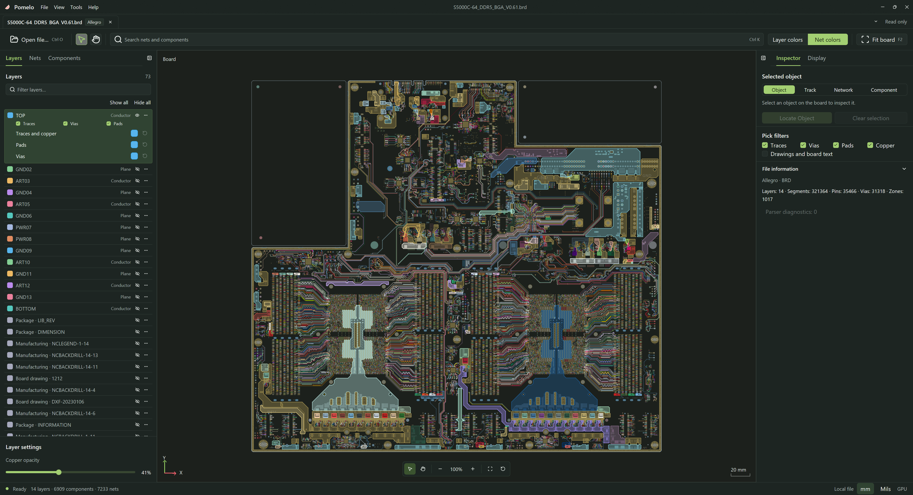
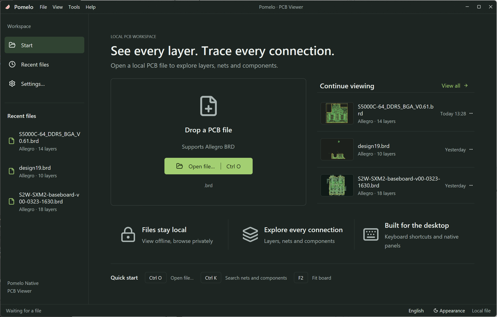

<p align="center">
  
</p>

<h1 align="center">Pomelo Desktop · PCB Viewer</h1>

<p align="center">
  <strong>すべての接続を、レイヤーごとに見渡す。</strong><br>
  Rust と GPUI Kit で構築したネイティブ PCB ビューアー。Windows 上でファイルをローカルに処理し、GPU 描画で Cadence Allegro の基板を確認できます。
</p>

<p align="center"><a href="README.md">English</a> · <a href="README_zh-CN.md">简体中文</a> · <a href="README_zh-TW.md">繁體中文</a> · 日本語 · <a href="README_ko.md">한국어</a></p>

<p align="center">
  
  
  
  
</p>



## 基板をより見やすく

- **設計データはローカルに。** 基板ファイルをアップロードせずに読み込み、表示できます。元のファイルは変更しません。
- **ネイティブ GPU 描画。** D3D11 と HLSL で配線、円弧、パッド、ビア、銅箔と穴、図形、MSDF による基板テキストを描画します。
- **接続を追跡。** ネットや部品を検索し、結果に移動して選択したオブジェクトの属性を確認できます。
- **表示を調整。** レイヤーの管理、レイヤー別・ネット別の色分け、銅箔の不透明度、パッドの塗りつぶし、ラベルを設定できます。
- **複数の基板を扱う。** 複数ドキュメント、最近使ったファイル、表示設定の保存に対応しています。
- **言語とテーマを選ぶ。** 英語、簡体字中国語、繁体字中国語、日本語、韓国語の UI と、ライト・ダークテーマを利用できます。

> **開発中：** BRD MVP 全体の受け入れ検証は未完了です。描画精度、大規模基板の性能、DPI・入力方式、長時間動作の安定性には追加検証が必要です。読み取り専用のビューアーであり、基板の編集や DRC は行いません。検証範囲は[開発状況](docs/development-progress.md)を参照してください。

## 対応形式

現在は **Cadence Allegro のバイナリ `.brd` ファイル**に対応しています。同じ拡張子を使う他の EDA ツールの形式への対応を意味するものではありません。読み込み範囲と描画精度はファイルのバージョンと内容によって異なります。Web 版で対応している他の形式は、このデスクトップ版にはまだ実装されていません。

## クイックスタート

**Windows x64**、**Direct3D 11** に対応する GPU とドライバー、**Git**、**Python 3.12+**、Rust、および **MSVC C++ ビルドツールと Windows SDK** が必要です。`rust-toolchain.toml` で Rust **1.98.1** を固定し、依存関係のバージョンは `Cargo.lock` で管理しています。

```powershell
git clone https://github.com/HaiwenZhang/Pomelo-Desktop.git
cd Pomelo-Desktop
python scripts/cargo.py run -p pomelo --locked
```

**Ctrl+O**、ドラッグ＆ドロップ、または起動時のファイルパス指定で基板を開きます。アプリのメニューまたはツールバーから表示言語を選択できます。



```powershell
python scripts/cargo.py run -p pomelo --locked -- --locale ja --encoding windows-1252 "C:\boards\example.brd"
```

`--locale` は `en`、`zh-CN`、`zh-TW`、`ja`、`ko` に対応します。その起動にのみ適用され、保存済みの言語設定は変更しません。`--encoding` は `utf-8`、`gbk`、`shift_jis`、`big5`、`windows-1252` に対応し、既定値は厳密な UTF-8 です。指定した文字コードはそのプロセスで開くファイルに適用されます。UI 言語とファイルの文字コードは独立しています。`--` 以降の引数はすべてファイルパスとして扱います。

## ショートカット

| 操作 | キー |
| --- | --- |
| ファイルを開く | `Ctrl+O` |
| ドキュメントを閉じる | `Ctrl+W` |
| ドキュメントを再読み込み | `Ctrl+R` |
| 次／前のドキュメント | `Ctrl+Tab / Ctrl+Shift+Tab` |
| 基板全体を表示 | `F2` |
| 検索にフォーカス | `Ctrl+K` |
| 設定 | `Ctrl+,` |
| 左／右パネルの切り替え | `Ctrl+B / Ctrl+Shift+B` |

## ビルドと開発

Cargo ラッパーは `.cache/gpui/` にローカルの GPUI GPU パッチを準備します。グローバルな Cargo registry は変更しません。通常の Cargo や rust-analyzer を初めて使う前に、`python scripts/prepare_gpui.py` を実行してください。[パッチの説明](patches/gpui/README.md)も参照してください。通常のデスクトップ利用に Node.js や Web 版のリポジトリは不要です。macOS と Linux は今後の計画であり、現在のネイティブアプリと GPU バックエンドは Windows を対象としています。

```powershell
python scripts/cargo.py build -p pomelo --locked
python scripts/cargo.py test --workspace --locked
python scripts/cargo.py clippy --workspace --all-targets --locked -- -D warnings
python scripts/cargo.py run -p pomelo-import --bin pcb_inspect --locked -- --help
```

| 場所 | 内容 |
| --- | --- |
| [crates/pomelo-core](crates/pomelo-core) | 基板モデル、検索、選択、国際化 |
| [crates/pomelo-import](crates/pomelo-import) | Allegro の解析とインポート診断 |
| [crates/pomelo-render](crates/pomelo-render) | シーン準備、D3D11 描画、HLSL シェーダー |
| [crates/pomelo](crates/pomelo) | GPUI デスクトップアプリとドキュメント管理 |
| [locales](locales) | 5 言語の UI リソース |
| [docs](docs) | 開発計画と検証記録 |

- [開発計画](docs/native-pcb-viewer-development-plan.md)
- [開発状況と検証範囲](docs/development-progress.md)
- [i18n](docs/i18n.md)
- [GPU / ADR](docs/adr/0001-native-gpu-rendering.md)

## 貢献

Allegro 互換性、描画精度、性能、翻訳、ドキュメントへの貢献を歓迎します。[不具合の報告](https://github.com/HaiwenZhang/Pomelo-Desktop/issues)には、元のツールとファイルのバージョン、Windows と GPU の情報、再現手順、インポート診断を添えてください。小さなサンプルや比較画像が役立ちます。共有前に機密の設計データを除去してください。解析や幾何処理の変更には対象を絞った回帰テストを、表示変更にはスクリーンショットを添え、5 言語の README を同期してください。

## ライセンス

プロジェクトのコードは [MIT ライセンス](LICENSE)です。同梱フォントにはそれぞれのライセンスが適用されます。[Source Han Sans](assets/fonts/source-han-sans/README.md)と[ストロークフォント](assets/fonts/stroke/README.md)を参照してください。
