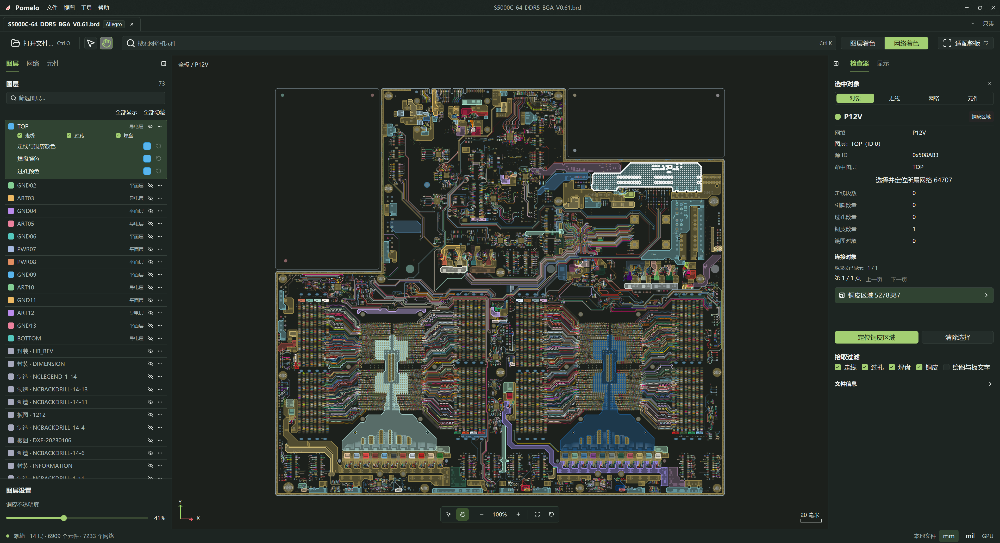
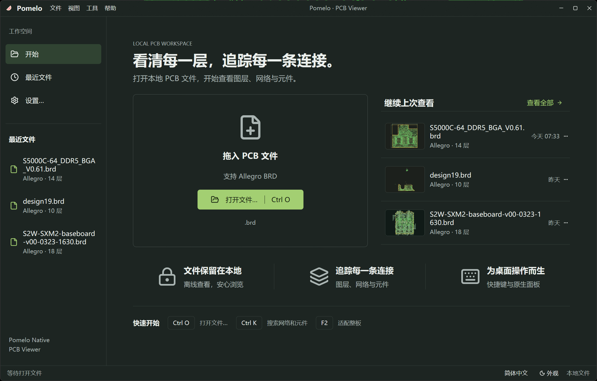

<p align="center">
  
</p>

<h1 align="center">Pomelo Desktop · PCB Viewer</h1>

<p align="center">
  <strong>逐层看清每一处连接。</strong><br>
  基于 GPUI 和 GPUI Kit 的 PCB 查看器，支持 Cadence Allegro (.brd)、Altium Designer、ODB++、PADS、Ansys HFSS 3D Layout(edb.def) 和 KiCad。
</p>

<p align="center"><a href="README.md">English</a> · 简体中文 · <a href="README_zh-TW.md">繁體中文</a> · <a href="README_ja.md">日本語</a> · <a href="README_ko.md">한국어</a></p>

<p align="center">
  
  
  
  
</p>



## 更清晰地查看电路板

- **设计文件留在本地。** 在电脑上导入和查看电路板，无需上传；查看操作不会修改源文件。
- **原生 GPU 渲染。** 使用 D3D11/HLSL、Metal/MSL 与 wgpu/WGSL 显示走线、圆弧、焊盘、过孔、铜皮及孔洞、绘图和 MSDF 板文字。
- **追踪连接。** 搜索网络与元件，定位搜索结果，并检查选中对象的属性。
- **控制显示。** 管理图层，按图层或网络着色，调整铜皮透明度、焊盘填充和标签显示。
- **同时查看多块板。** 支持多文档、最近文件与视图偏好保存，方便继续查看设计。
- **选择熟悉的语言。** 提供简体中文、繁体中文、英文、日文、韩语界面，以及浅色和深色主题。

> **开发中：** 完整 BRD MVP 验收尚未完成。显示精度、大板性能、DPI／输入法和长期运行稳定性仍需更广泛验证。本项目是只读查看器，不编辑电路板，也不执行 DRC。验证范围见[开发进展](docs/development-progress.md)。

## 支持的格式

当前支持 **Cadence Allegro 二进制 `.brd` 文件**。这不代表支持其他 EDA 工具使用的同名扩展名。导入范围与显示精度取决于文件版本及其内容。Web 版支持的其他格式尚未接入本桌面项目。

## 快速开始

macOS 需要支持 Metal 的 Mac 与 Xcode Command Line Tools。Linux 需要 fontconfig、FreeType、xkbcommon、Wayland/X11、ALSA、OpenSSL 开发包，以及支持 Vulkan 的显卡驱动。下方构建命令适用于三个平台；macOS 应用快捷键使用 Cmd 代替 Ctrl。

需要 **Windows x64**、支持 **Direct3D 11** 的显卡与驱动、**Git**，以及 Rust、**MSVC C++ 构建工具和 Windows SDK**。仓库通过 `rust-toolchain.toml` 固定 Rust **1.98.1**，依赖版本以 `Cargo.lock` 为准。

```powershell
git clone https://github.com/HaiwenZhang/Pomelo-Desktop.git
cd Pomelo-Desktop
cargo run -p pomelo --locked
```

使用 **Ctrl+O**、拖放或启动文件路径打开电路板。在应用菜单或工具栏中选择界面语言。



```powershell
cargo run -p pomelo --locked -- --locale zh-CN --encoding windows-1252 "C:\boards\example.brd"
```

`--locale` 支持 `en`、`zh-CN`、`zh-TW`、`ja`、`ko`，仅对本次启动生效，不覆盖已保存的语言偏好。`--encoding` 支持 `utf-8`、`gbk`、`shift_jis`、`big5`、`windows-1252`，默认严格 UTF-8；所选编码作用于本次进程打开的文件。界面语言与源文件编码相互独立。`--` 后的参数全部作为文件路径。

## 快捷操作

| 操作 | 按键 |
| --- | --- |
| 打开文件 | `Ctrl+O` |
| 关闭文档 | `Ctrl+W` |
| 重新加载文档 | `Ctrl+R` |
| 下一个／上一个文档 | `Ctrl+Tab / Ctrl+Shift+Tab` |
| 适应电路板 | `F2` |
| 聚焦搜索 | `Ctrl+K` |
| 设置 | `Ctrl+,` |
| 切换左侧／右侧面板 | `Ctrl+B / Ctrl+Shift+B` |

## 构建与开发

GPUI 暂时依赖 [HaiwenZhang/zed 的 gpui-pre-0.3.7-native-gpu 分支](https://github.com/HaiwenZhang/zed/tree/gpui-pre-0.3.7-native-gpu)，由 Cargo.lock 锁定到 `8c92bda2dc9d718cd520d37fda20bca00fa3e274`。Cargo 直接获取该 fork，无需准备本地补丁。薄包名适配层让 GPUI Kit 0.7.0 使用同一套 GPUI 类型。详见 [GPUI 依赖说明](docs/gpui-dependencies.md)。正常桌面运行不需要 Node.js 或 Web 仓库。Windows 使用 D3D11，macOS 使用 Metal，Linux 使用 wgpu；共用场景与批次逻辑，各平台独立维护着色器。 GPUI Kit 直接使用 registry 原版包，普通 Cargo 和 rust-analyzer 无需补丁准备。

```powershell
cargo build -p pomelo --locked
cargo test --workspace --locked
cargo clippy --workspace --all-targets --locked -- -D warnings
cargo run -p pomelo-import --bin pcb_inspect --locked -- --help
```

### Release 打包

| 平台／架构 | 产物 | 命令 |
| --- | --- | --- |
| Windows x64 | `.exe` | `scripts\build-windows.bat` |
| macOS arm64 / x64 | `.dmg`, `.app.zip` | `scripts/build-macos.sh` |
| Ubuntu 24.04+ amd64 / arm64 | `.deb`, `.tar.gz` | `scripts/build-ubuntu.sh` |

需要 Rust 和各平台原生构建依赖；macOS 另需 ImageMagick，Windows 另需 Inno Setup 6，Ubuntu 另需 `dpkg-dev` 和 `desktop-file-utils`。产物输出到 `dist`。

Shell 脚本支持 `--offline`、`--toolchain NAME`、`--output-dir PATH`，以及 `--binary PATH` 打包已有程序。正式构建使用 `cargo build --release --locked`，无需 Python。

Ubuntu Release 固定在 24.04 构建，保持 24.04 的 ABI 基线，并在 CI 中检查 26.04 安装和运行。若本地在更新的 Ubuntu 构建，可能引入更新的库版本要求。

macOS 默认临时签名，最低版本为 macOS 14.0。可设置 `MACOS_SIGNING_IDENTITY` 使用钥匙串中的签名身份，尚未配置 Apple 公证。

[Release 工作流](.github/workflows/release.yml)：推送 `vX.Y.Z` 标签后构建全部平台，通过验证后发布安装包和 `SHA256SUMS`；标签必须与 `Cargo.toml` 的 workspace 版本一致。手动触发仅上传 Actions 产物。


| 目录 | 用途 |
| --- | --- |
| [crates/pomelo-core](crates/pomelo-core) | 电路板模型、搜索、选择与国际化 |
| [crates/pomelo-import](crates/pomelo-import) | Allegro 解析与导入诊断 |
| [crates/pomelo-render](crates/pomelo-render) | 场景准备与 D3D11、Metal、wgpu 渲染 |
| [crates/pomelo](crates/pomelo) | GPUI 桌面应用与文档管理 |
| [locales](locales) | 五种语言的界面资源 |
| [docs](docs) | 研发计划与验证证据 |

- [研发计划](docs/native-pcb-viewer-development-plan.md)
- [开发进展与验证范围](docs/development-progress.md)
- [i18n](docs/i18n.md)
- [GPU / ADR](docs/adr/0001-gpui-pre-0.3.7-native-gpuing.md)

## 参与贡献

欢迎改进 Allegro 兼容性、渲染精度、性能、翻译和文档。[报告问题](https://github.com/HaiwenZhang/Pomelo-Desktop/issues)时，请附上源工具与文件版本、操作系统和 GPU 信息、复现步骤及导入诊断。小型样本或对照截图有助于定位问题；分享前请移除保密设计数据。解析或几何变更应提供针对性的回归测试，视觉变更应附截图，并保持五种语言的 README 同步。

## 许可证

项目代码采用 [MIT 许可证](LICENSE)。内置字体保留各自的许可证，详见[思源黑体](assets/fonts/source-han-sans/README.md)。

## 致谢

感谢 [GPUI](https://github.com/zed-industries/zed/tree/main/crates/gpui) 和 [GPUI Kit](https://github.com/longbridge/gpui-kit) 项目，为 Pomelo Desktop 提供 GPU 加速的 UI 框架和 UI 组件。
