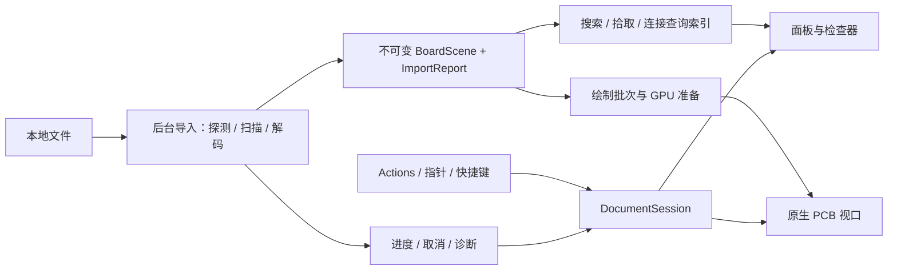

# Pomelo 原生桌面 PCB Viewer 研发计划

> 编制日期：2026-10-01；最近修订：2026-10-04（面板收缩、锚点应用接入与五语搜索排序；保留已确认的依赖和平台边界）。本文基于本地 Wake、Pomelo Web 源码、三张桌面 UI 设计稿及 `E:\brd_cases` 案例目录编制。目标是建立可执行、可验收的研发路线；本文中的工期和性能指标为拟定目标，实现及验证状态以单独的证据记录为准。

> 开发证据单独维护于 [development-progress.md](development-progress.md)，i18n 实施契约见 [i18n.md](i18n.md)。下文调研现状保留编制时点，不能据此推断最新实现状态。

> 最新 Windows GPU 进展：真实走线/圆弧已接入 `pomelo-render` D3D11/HLSL 与 GPUI 同窗口入口。硬件像素测试及小型 FPC 上传/呈现记录见 [gpu-trace-validation.md](gpu-trace-validation.md)；这不代表全部 PCB 图元、实窗视觉或大板验收完成。

> 板框与铜皮进展：板框和铜皮已接入同设备绘制，铜皮重叠孔洞硬件像素测试及真实 FPC 上传/呈现通过，见 [gpu-copper-validation.md](gpu-copper-validation.md)。逐层合成、曲边抗锯齿及大板铜皮验收仍待完成；此前 FPC/AGILEX 板框提交和铜皮准备记录见 [outline-copper-preparation-validation.md](outline-copper-preparation-validation.md)。

> 当前开发优先级：按用户要求先落实 `docs/ui-design` 的原生 UI。欢迎页、工作区及可调侧栏已接入真实数据，实窗证据和未完成的可见差异见 [UI 设计验证记录](ui-design-validation.md)。五语 i18n 和现有 D3D11/HLSL 业务边界继续作为约束。

> 图层/网络着色已接入正式 Windows 管线：沿用 Web 调色板，同源网络跨图元一致，模式按文档恢复且切换不重上传几何。硬件及实窗证据见 [网络着色验证](network-colors-validation.md)；完整五语工作区、DPI、大板性能和发布验收仍按原范围进行。

## 1. 项目目标与交付边界

以 Rust + GPUI Kit 实现本地、只读、原生渲染的 PCB Viewer。用户可以打开电路板，按图层查看，搜索网络或元件，定位和高亮连接，通过检查器了解对象及走线信息，并在多文档之间保留各自的查看状态。

核心路线：**借鉴 Wake 的核心库与桌面应用分层，移植 Web 版的数据语义和几何算法，按现有设计稿实现原生文档工作区。先打通 BRD 端到端链路，再扩展格式。**

**核心技术约束：当前只开发 Windows，PCB GPU 渲染采用复用 GPUI 同一设备与窗口呈现的 D3D11/HLSL 路线。GPUI 补丁只提供通用注册、绘制及生命周期入口；PCB 几何、shader、业务管线与 GPU 缓存全部在 `pomelo-render` 实现。国际化采用 [`longbridge/rust-i18n`](https://github.com/longbridge/rust-i18n)，从 M0 起按 i18n 优先开发。英文、简体中文、繁体中文、日文、韩语是首版核心支持项，覆盖界面、导入与解析诊断、后台任务、GPU 和系统错误，不作为后期补译功能。**

2026-10-01 路线修订：用户接受各平台原生 shader 实现，取消此前对 `wgpu + WGSL` 的强制要求。Windows 已选定 D3D11/HLSL 接入 GPUI 自身渲染器，三角形及三种 PCB 图元小场景已实窗验证；已经完成的 wgpu 三角形仅保留历史验证记录，实验源码与直接依赖已于 2026-10-03 按用户要求移除。决策与待验证项见 [ADR 0001](adr/0001-native-gpu-rendering.md)。

2026-10-02 平台范围确认：**当前只开发、验证和交付 Windows。** 三端架构采用“统一 GPU 注册/绘制入口 + `pomelo-render` 三套平台后端”，macOS/Metal/MSL 与 Linux/wgpu/WGSL 仅记录后续方案，待单独启动平台移植阶段。架构见 6.3，当前 Windows 实施计划见 6.4。

### 1.1 发布范围

| 阶段 | 范围 | 完成标准 |
| --- | --- | --- |
| 技术原型 | GPUI 原生窗口、真实 PCB 场景、渲染接入、后台任务、五语 i18n 基础 | 证明窗口、GPU、输入、DPI 和大板路径可行；验证五语切换和结构化错误翻译，形成技术决策记录 |
| BRD MVP | Windows x64；BRD 导入、图层、导航、搜索、四种选择模式、检查器、五语界面与导入诊断 | 小中型板形成完整查看流程；大板完成正确性与性能基线；新增功能五语同步交付 |
| v1.0 | Windows x64；BRD 回归、多标签页、最近文件、状态恢复、深浅主题、英/简中/繁中/日/韩、发布包 | 通过本文验收门槛和五语完整性检查，形成可交付桌面版本 |
| 后续版本 | KiCad → Altium → PADS / ODB++ / HFSS；macOS、Linux 正式支持 | 每种格式与平台独立验收，按样本和实际需求调整顺序 |

Windows 首发及当前仅开发 Windows 是用户确认的范围。核心层保持可移植；已有无窗口核心测试的多平台 CI 可用于检查共享代码，但当前不新增 macOS/Linux 应用、GPU 后端、shader、打包或实机任务，也不把其验收作为 Windows 发布前提。设计稿欢迎页展示六类格式，属于最终能力方向：BRD 首发时必须只展示已通过验收的格式，不提前承诺完整支持。

首版不包含 PCB 编辑、保存回原格式、布线、铜皮重新灌注、DRC、SI/PI 求解、3D 查看、云协作。走线长度是已解析几何的统计，不等同于电气长度或源 EDA 工具的约束验证。自由停靠、任意分屏和插件系统暂不纳入首版。

## 2. 调研依据与现状

### 2.1 本次实际检查的材料

| 材料 | 已确认信息 | 对计划的影响 |
| --- | --- | --- |
| 当前桌面仓库 | 尚无根目录 Cargo 工程；已有 `references/Wake`、UI 图片和基础文件 | 按新建原生工程规划，不假定存在桌面业务实现 |
| Wake | Cargo workspace 包含 `wake-core`、`wake`；核心层独立，应用层负责 GPUI 生命周期 | 沿用职责分离、窗口治理、后台事件和测试组织方式 |
| Web 项目 | React / TypeScript / Zustand / WebGPU；统一 `BoardScene`；六类格式导入器 | Rust 移植以领域契约为基础，UI 和浏览器生命周期重新实现 |
| 桌面 UI | 深色工作区、浅色工作区、深色欢迎页 | 已覆盖主布局；需补齐加载、错误、无结果、设置等状态规格 |
| BRD 案例 | 实查 156 个 `.brd`，共 7,745,124,096 字节；读取文件头识别布局族 | 建立本地兼容性清单、大小分档和性能基准 |

Web 仓库检查时 HEAD 为 `1e420b41b9a789859124b13f60e546b7023cb14a`；`package.json` 有修改，`docs/`、`scripts/` 尚未跟踪。因此本文引用的是**当时的工作区内容**，仅记录 HEAD 不足以复现。M0 必须对基准源码、脚本和样本建立哈希清单。当前桌面仓库已有用户修改；本计划不要求覆盖这些修改。

本次只检查源码、文档、图片和案例元数据/文件头，未执行 156 个文件的完整解析，未构建原生程序，未测得原生帧率。Web 的历史测试结果只作为迁移输入，不能算作桌面版通过记录。

### 2.2 Wake 可借鉴的结构

| Wake 位置 | 实际职责 | Pomelo 的对应方案 |
| --- | --- | --- |
| `Cargo.toml` | 工作区、共享依赖、开发构建优化 | 根工作区集中约束依赖和 profile，提交锁文件 |
| `wake-core/src/models.rs` | 核心数据类型 | 统一板级模型、对象标识、选择与诊断类型 |
| `wake-core/src/adapters/mod.rs` | 多来源适配器契约 | 按格式实现 `BoardImporter`，格式知识不进入界面 |
| `wake-core/src/services/` | 应用服务与平台差异隔离 | 本地文件、配置、诊断导出、系统集成边界 |
| `wake/src/main.rs` | 启动、Root、Actions、快捷键、菜单、窗口入口 | 保持入口薄；只做装配，不解析板文件 |
| `wake/src/main_window.rs` | 窗口位置、显示器、最大化/关闭恢复 | 复用思路，测试拔除显示器及 DPI 改变后的恢复 |
| `wake/src/workbench.rs` | 主界面协调、后台事件、任务持有与 generation 校验 | 拆为工作区、文档和面板实体，避免所有业务集中在一个大文件 |
| `wake/src/prefs.rs`、`theme.rs`、`i18n.rs`、`assets.rs` | 偏好、主题、本地化与资源 | 保留独立模块边界，配置采用版本化数据和可靠落盘 |
| `wake-core/tests/`、`.github/workflows/` | 核心契约测试、应用逻辑测试、多平台构建 | 分离无窗口测试、真实 GPU 验收和外部大样本回归 |

不直接搬入 Wake 的会话数据库、全文检索、远程同步、MCP、索引锁或更新系统。PCB 首版最近文件与偏好可使用小型配置文件，无需为模仿参考项目引入 SQLite。Wake 的后台事件使用方式值得借鉴，但 PCB 的高频进度和大几何数据应采用有界通道或合并通知，避免无界积压。

### 2.3 依赖基线需单独冻结

Wake 当前引用 Zed Git 版 `gpui` / `gpui_platform`，并固定 `gpui-component` 修订 `fd3bc2bbb8a2c4dfe268c1475682476ada54cd0c`。它是可研究的历史组合，不代表新工程应照抄依赖版本。

GPUI Kit 当前官方安装说明采用统一 `gpui-kit` 入口并配套 GPUI 快照，要求保持相关依赖一致。新工程优先验证这一入口；若渲染接入需要其他组合，必须在 M0 记录原因和锁定修订，不混用不兼容的 GPUI 类型。[官方安装说明](https://gpui-kit.com/docs/installation/)

M0 交付 `rust-toolchain.toml`、`Cargo.lock`、平台构建要求和依赖决策记录。具体 Rust、Kit、图形库版本以可复现的编译与运行验证为准，不将浮动 Git HEAD 作为发布基线。

根工作区统一声明 `rust-i18n` 与实际使用的图形依赖，锁定经验证的版本。禁止在 Windows D3D11 后端及其测试中使用 wgpu。项目不声明独立 `wgpu 30.0.1` 依赖，共享场景、字体布局与交互算法保持平台无关；若复用 GPUI 的 wgpu 后端，必须对齐框架版本与设备，不能混用不同版本的 GPU 类型。`rust-i18n` 与 GPUI Kit 所用组件的依赖组合一起验证，避免多个不兼容版本造成 locale 状态不同步。Wake 的语言偏好、启动初始化与菜单重建流程可参考；其自制翻译引擎不移植，使用指定的 `rust-i18n`。

## 3. Web 能力迁移矩阵

以下路径均相对于 `C:\Users\Zen\Desktop\gitrepo\pomelo`。

| 现有实现 | 桌面迁移内容 | 方式 / 优先级 |
| --- | --- | --- |
| `src/lib/board/model.ts`、`board/shapes/` | mm 坐标、图层、网络、线段/圆弧、焊盘、过孔、铜皮、板框、文字 | 建立 Rust 类型和几何契约，P0 |
| `src/lib/allegro/binary/` | 文件头、布局族、字符串表、记录扫描、偏移索引 | 保留二进制扫描 + 按需解码路线，P0 |
| `allegro/database.ts`、`decoders/`、`scene-builder.ts` | 记录引用关系与统一场景构建 | 分层移植，不把原始记录结构泄漏给 UI，P0 |
| `src/lib/board/copper-mesh.ts` 及公共几何模块 | 铜皮孔洞、曲线、填充和三角化 | 先保证语义，再依据 profile 优化，P0 |
| `src/lib/render/`、`*.wgsl` | 批处理、裁剪、着色、精度拆分、文字图集、选择覆盖层 | 复用算法与 shader 语义；GPU 宿主与资源管理重写，P0 |
| `src/lib/interaction/` | 相机、坐标转换、空间索引、拾取、hover 信息 | 从 DOM 坐标适配为 GPUI 逻辑/物理像素，P0 |
| `board/search.ts`、`components/board-search.tsx` | 网络/元件索引、搜索、定位 | 纯数据索引与原生搜索面板分离，P0 |
| `components/layers-panel.tsx`、`display-controls.tsx`、`display-order-panel.tsx` | 可见性、着色、透明度、标签与显示顺序 | 用 Kit 组件重建，P0/P1 |
| `components/object-inspector.tsx` | 对象/走线/网络/元件检查，长度和连接信息 | UI 只消费查询结果，P0 |
| `src/lib/viewer-store.ts`、`app/useBoardSurface.ts` | 导入、取消、错误、场景准备、渲染生命周期 | 拆成每文档会话和任务状态机，P0 |
| `src/lib/text/`、`public/fonts/source-han-sans/` | 最新 MSDF 板文字与标签 | 同步度量、JSON/PNG、布局与采样；保留 OFL-1.1，UI 字体保持原状 |
| `src/lib/{kicad,altium,pads,odb,hfss}/` | 后续多格式导入 | 通过相同导入契约接入，P2 |
| `tests/`、`scripts/check-cases.ts`、`bench-parser.ts`、`scene-fingerprint.ts` | 正确性、案例回归、性能和结构指纹 | 转化为跨语言对照工具，不要求桌面运行时携带 JS，P0 |

保留 Web 已知限制：例如 KiCad 当前不显示板中文字和封装图文，ODB++ 当前不支持 panel step-repeat 与负极性层；这些不会因 Rust 重写自动消失。新增格式发布时分别列明支持对象、版本、限制与诊断，不能只列扩展名。

## 4. 目标架构与代码组织

### 4.1 工作区结构

沿用 Wake 的“核心库 + 应用”方向，但针对解析复杂度和 GPU 资源治理增加导入、渲染两个库。GPU 资源与框架设备生命周期对齐。应用先控制为四个 crate，框架补丁单独隔离，避免按每个控件拆包。

以下结构是开发必须遵循的职责约定。现有模块已迁入核心层的 `model / geometry / interaction / search`、渲染层的 `scene / backend / text / shaders` 和应用层的对应目录；设置页面等尚未实现的功能随实际开发落入约定位置。当前目录及剩余拆分职责见 [code-organization.md](code-organization.md)。

```text
Pomelo-Desktop/
├── Cargo.toml / Cargo.lock / rust-toolchain.toml
├── crates/
│   ├── pomelo-core/                 # 无 GPUI、无 GPU、无浏览器依赖
│   │   ├── src/model/               # BoardScene、类型化 ID、图层、诊断
│   │   ├── src/geometry/            # 圆弧、焊盘、轮廓、孔洞、长度
│   │   ├── src/interaction/         # 相机数学、拾取、选择语义
│   │   ├── src/search/              # 网络/元件索引
│   │   ├── src/i18n.rs              # Locale、消息契约、共享 rust-i18n 翻译入口
│   │   └── tests/
│   ├── pomelo-import/
│   │   ├── src/lib.rs               # BoardImporter、注册表、导入上下文
│   │   ├── src/allegro/             # binary → database → decoders → scene
│   │   ├── src/bin/pcb_inspect.rs    # 无窗口：probe / inspect / check / bench
│   │   └── tests/                   # 合成样本、版本契约、外部案例入口
│   ├── pomelo-render/
│   │   ├── src/scene/               # 绘制批次、空间裁剪、精度转换
│   │   ├── src/backend/             # 当前 D3D11；复用 GPUI 的设备与呈现
│   │   ├── src/text/                # 板文字、图集、标签 LOD
│   │   ├── src/shaders/             # 当前 HLSL；MSL / WGSL 留待平台移植
│   │   └── tests/
│   └── pomelo/                      # GPUI Kit 原生应用
│       ├── src/main.rs / app.rs / actions.rs
│       ├── src/main_window.rs
│       ├── src/workbench/           # 文档标签、布局、全局命令协调
│       ├── src/document/            # 文档会话、任务、视图状态
│       ├── src/viewport/            # GPUI Element 与渲染器适配
│       ├── src/panels/              # 图层、网络、元件、检查器、显示
│       ├── src/welcome/ / settings/
│       ├── src/services/            # 文件入口、偏好、最近文件、系统集成
│       ├── src/theme.rs / i18n.rs / assets.rs
│       └── assets/ / tests/
├── locales/                        # 共享五语资源：en / zh-CN / zh-TW / ja / ko.yml
├── tests/fixtures/                  # 小型合成或获准分发的样本
├── scripts/                        # 差分、案例清单、性能、发布脚本
├── docs/                           # 计划、ADR、格式覆盖、验收与报告
└── references/Wake/                 # 只作参考，不成为运行依赖
```

依赖方向：`pomelo → pomelo-import / pomelo-render / pomelo-core`；`pomelo-import → pomelo-core`；`pomelo-render → pomelo-core`。核心层不反向依赖应用；渲染器不调用格式解析器；导入器不获取窗口或 GPUI `Context`。后续格式先在 `pomelo-import` 内模块化，只有编译、维护或发布需求明确时再拆 crate。

**三角剖分固定使用用户指定的 `earcut` 0.4.11。** 根 `Cargo.toml` 以 `earcut = "=0.4.11"` 精确约束版本，`pomelo-core` 使用 `earcut.workspace = true`，`Cargo.lock` 锁定 0.4.11。算法实现归属 `pomelo-core/src/geometry/copper.rs`，在 CPU 上生成网格；渲染层消费网格并准备平台批次。当前铜皮实现分别三角化外轮廓和孔洞，再由 GPU 孔洞遮罩合成，保持重叠孔洞的并集语义；凹轮廓使用 `earcut::Earcut<f64>`，凸轮廓保留等价的快速路径。剖分失败、非法坐标、资源预算及取消均遵循共享诊断和 i18n 契约。

### 4.2 数据流



### 4.3 状态所有权

| 对象 | 所有内容 | 生命周期与限制 |
| --- | --- | --- |
| `AppState` | 配置、主题/语言偏好、最近文件、窗口注册 | 应用级；不存大板几何 |
| `Workbench` | 文档集合、当前文档、左右面板布局、命令入口 | 窗口级；不实现解析和三角化 |
| `DocumentSession` | 文档 ID、源路径、加载状态、场景引用、显示和选择状态 | 每个标签独立；重新加载具有新 revision |
| `BoardScene` | 格式无关的不可变几何与语义 | `Arc` 共享；不因 hover、切层或主题变化复制整板 |
| `DocumentQueries` | 搜索、空间和连接索引 | 与 scene revision 绑定，不能引用已关闭文档 |
| `ViewportRenderer` | GPU 缓冲、管线、图集、帧资源 | 显式释放；非活动标签可按预算回收 GPU 缓存 |
| 各面板 Entity | 输入、滚动、展开项、焦点 | 订阅文档变化，不保留另一套完整领域状态 |

禁止用一个全局可变 `ViewerState` 承载所有标签。共享场景数据与各文档显示选项分离；GPUI 更新在前台完成，耗时查询、I/O、解析和几何构建放后台。以稳定对象 ID 保持过滤、排序后的选择，而非用列表下标作为身份。

### 4.4 导入契约和任务治理

拟定接口语义：

- `probe(header, file_metadata) → FormatProbe`：有界读取识别格式、布局族与支持状态，扩展名仅作提示。
- `import(source, options, context) → ImportedBoard`：产出 `BoardScene`、源元数据及结构化诊断。
- `ImportContext`：取消令牌、资源预算、阶段事件；不得持有 UI 句柄。
- `ImportReport`：格式/写入器版本、对象覆盖、warning/error、记录类型/偏移、未知对象计数及耗时。
- 错误、警告与进度采用稳定的 `code + message_key + typed_args + source_location`；不以预先翻译的 `String` 作为唯一契约。由共享翻译入口按调用方 locale 生成用户文案，详见 4.5。

状态机：`Empty → Reading → Indexing → Decoding → BuildingGeometry → PreparingGpu → Ready`；各耗时阶段可转入 `Cancelling → Cancelled` 或 `Failed`。阶段未知工作量时显示阶段与不定进度，不能用伪百分比掩盖停顿。

每个请求携带 `DocumentId + RequestGeneration`。关闭、重新打开、切编码或重试使旧 generation 失效；旧任务即使完成也不能覆盖新结果。取消须贯穿扫描、铜皮处理、三角化和 GPU 上传，持有 `Task` 不等于已经实现 CPU 取消。进度通知合并到约 10 Hz，可靠终态独立传递；GPU 上传分块，避免单次长时间占用前台。

初期最多同时处理一个重型导入任务，其余排队且可取消；之后再按实测内存预算调整。文档关闭立即撤销 UI 关联并取消任务，在可控阶段释放后台资源；不在 UI 析构路径同步等待长任务。

### 4.5 i18n 核心架构与开发约束（P0）

#### 支持语言与依赖

| 语言 | 规范 locale | 语言选择器自称 |
| --- | --- | --- |
| 英文 | `en` | English |
| 简体中文 | `zh-CN` | 简体中文 |
| 繁体中文 | `zh-TW` | 繁體中文 |
| 日文 | `ja` | 日本語 |
| 韩语 | `ko` | 한국어 |

采用 [`rust-i18n`](https://github.com/longbridge/rust-i18n) 的编译期资源嵌入、`i18n!`、`t!`、显式 `locale` 参数及英文 fallback；正式程序离线运行，不依赖运行时下载语言包。根目录 `locales/` 以 `_version: 1` 的五个 YAML 文件维护，英文为基准键集合，使用稳定语义键，例如 `menu.file.open`、`import.allegro.truncated_record`、`render.device_lost`。具体 crate 版本在 M0 构建、组件语言同步测试后锁定。[官方资源格式与 API](https://github.com/longbridge/rust-i18n#usage)

在 `pomelo-core::i18n` 初始化共享资源并提供 `Locale`、消息参数和显式 locale 的格式化入口；这只引入翻译库，不引入 GPUI、窗口或 GPU。应用 `pomelo::i18n` 负责系统语言、偏好、组件与菜单更新；CLI 复用共享翻译入口，不维护第二套译文。解析和几何逻辑保持与语言无关，稳定错误枚举通过集中映射获得消息键和参数；跨 crate 不各自初始化重复的业务语言资源。

#### 全链路消息契约

1. **用户可见范围**：菜单、按钮、提示、空态、设置、检查器字段、状态栏、进度、取消/重试、文件读写、配置恢复、启动失败、GPU 初始化/设备丢失、全部格式的错误和警告，以及 CLI 面向人的帮助和诊断。后续 KiCad、Altium、PADS、ODB++、HFSS 的每个新增诊断遵循同一要求。
2. **结构化错误**：底层返回类型化错误及稳定 `code`；附带消息键、命名参数、文件路径、记录类型、对象 ID、偏移和原因链。示例：`BRD_RECORD_TRUNCATED` → `import.allegro.truncated_record`，参数为 `offset`、`record_type`、`required_bytes`、`remaining_bytes`。参数作为数据传递，不拼接句子或在 reader/scanner 中提前翻译。
3. **展示时翻译**：UI 保存诊断结构，按当前 locale 渲染。切换语言后，已有诊断、任务阶段和检查器标签重新格式化，场景不重新解析。后台任务不修改全局 locale；CLI 和导出显式传入 locale，避免并发导出或测试串语言。
4. **第三方错误**：I/O、解析库、GPU/驱动错误映射成可翻译的摘要与恢复建议，原始原因保留在可展开的技术详情中。不能把 `err.to_string()`、`Debug` 或 `anyhow` 原始文本直接当作用户主提示，也不能只翻译“发生错误”而丢掉定位信息。
5. **机器数据稳定**：JSON/JSONL 报告保留固定字段、错误码、严重度、阶段枚举、参数和原始原因；需要人读时附加 `locale + localized_message`。差分、自动化、场景指纹不比较译文；任何业务逻辑不得依据翻译字符串判断错误类型。
6. **源文件内容**：网络名、元件 reference、板文字、路径、源写入器版本和格式标识保持原值，不翻译或自动简繁转换。BRD 的 UTF-8/GBK/Windows-1252 等解码选项与界面语言分离，切语言不改变解码结果。

#### 语言生命周期与格式化

- 启动按“已保存的显式语言 → 系统语言 → 英文”解析，在创建窗口和菜单之前初始化；设置提供“跟随系统”和五种显式选择。系统 tag 做大小写/分隔符规范化：`en-* → en`、`ja-* → ja`、`ko-* → ko`；中文优先 script（`Hans → zh-CN`、`Hant → zh-TW`），无 script 时 `CN/SG → zh-CN`、`TW/HK/MO → zh-TW`，裸 `zh` 明确映射简中。
- 中文回退链保持各自独立：`zh-CN → en`、`zh-TW → en`，不以另一种中文掩盖缺译；未支持或无效 locale 回退英文并保留可诊断记录。首版发布要求五语键完整，fallback 是运行时恢复机制，不能用于通过完整性验收。
- 切语言统一执行偏好保存、应用 locale 更新、GPUI 组件 locale 同步、原生菜单重建、窗口刷新和已缓存用户文案失效；不关闭文档或丢失相机、选择和导入进度。组件内置文案也纳入五语审查，缺译通过所锁定版本支持的扩展接口或应用封装补齐并测试。
- 使用 `%{name}` 等命名占位符保留语序自由；不通过“前缀 + 数字 + 后缀”拼句。数量的单复数/零值、数字、日期、单位及数值精度由共享格式化规则处理并测试，不假定 `t!` 自动提供完整的 CLDR/ICU 功能。机器报告使用固定数值与时间格式。
- 字体回退、输入法组合输入、搜索框和混合文字需覆盖简中、繁中、日文、韩文；缺字、截断和译文变长必须实窗验证。优先使用系统字体回退，新增分发字体需记录授权。

#### 后续开发的强制完成标准

- 每个功能或格式解析任务先定义消息键和参数，再编写用户可见文案；同一变更提交五语译文。既有原型中硬编码文案和提前字符串化的错误在 M1 集中迁移，未迁移项不得计入该阶段完成。
- 单独维护术语表（图层、网络、走线、焊盘、过孔、铜皮、板框等）和 `docs/i18n.md`，繁中译文单独审校，日/韩遵循相同业务含义。机器辅助译文需语义复核，不能直接视为已审校。
- CI 检查五语键集合一致、引用键存在、无空值/重复键、占位符集合一致、无发布用 TODO；扫描 UI、解析器、渲染器和 CLI 的用户文案硬编码。技术标识及第三方原始详情有明确例外，不能把整模块排除。
- `cargo i18n` 只辅助提取；它不能替代硬编码检查，也不能保证动态错误映射被发现。集中消息注册表/枚举映射加入覆盖测试，确保所有错误和警告变体都能在五语下格式化。
- 测试覆盖五语典型成功/失败、英文 fallback、无效 locale、缺参数、并行不同语言格式化、导入中切语言、已有诊断重译、持久化恢复、组件和菜单同步。每阶段完成新增页/状态的五语实窗检查，M6 汇总全流程验收。

## 5. BRD 解析与领域模型

### 5.1 解析分层

实施记录（2026-10-02）：Windows 的字符串表、记录边界扫描、紧凑索引、类型化记录 decoder 和数据库/引用保护已实现。156 案例完成全量边界差分及 204,384 条记录的字段抽样差分，见 [索引验证](brd-index-validation.md) 和 [记录解码验证](brd-record-decoder-validation.md)。物理图层、单位、路径/圆弧和铜皮轮廓语义已实现，4,368 条真实抽样查询通过 Web 对照，见 [几何验证](brd-geometry-validation.md)。Padstack/焊盘/钻孔定义、特殊引用及其共享缓存已实现，16,149 条请求通过独立对照，见 [焊盘验证](brd-padstack-validation.md)。完整网络归属已在 156 案例全部对照，封装/引脚放置有 620 个封装、22,268 个引脚的真实抽样证据，见 [网络与放置验证](brd-connectivity-placement-validation.md)。走线/过孔放置和键合对象已实现：10,027 条请求在 156 案例全部匹配，包含所有 28 条键合线与 28 个键合指，见 [走线与过孔验证](brd-routing-validation.md)。铜皮独立外环/孔洞网格、hatch 走线、旋转矩形与板框已实现，六代表板 704 条查询全部匹配，包含 4,642 个孔洞，见 [铜皮网格验证](brd-copper-validation.md)。文字/尺寸绘图、聚合场景输出预算及完整 SceneBuilder 已实现，AllegroImporter 已接通文件到共享 CPU 场景的入口；六代表板完整文字/尺寸字段和整板统计/对象顺序/边界通过对照，见 [文字与场景验证](brd-annotation-scene-validation.md)。桌面后台已接入单并发排队的完整 importer、取消和合并阶段进度，实窗验收待补；真实 PCB GPU 视口、全部字段与 156 案例整板回归仍待完成；铜皮单环取消延迟及真实 GPU 覆盖合成也待验收。编码、预算及验证边界按记录保留，不能把分层语义通过视作整板场景验收。

1. **文件读取与识别**：检查 magic、布局族、长度、单位除数；明确区分 Allegro BRD 与同扩展名其他格式。
2. **二进制扫描**：验证记录边界，构建 `Key → offset` 和 `Type → offsets`，不建立全量 AST。
3. **按需记录解码**：保留跨记录引用和源位置，限域缓存常用 padstack、字体等共享语义。
4. **语义解析**：图层、网络、元件/引脚、线段、圆弧、过孔、铜皮、板框、文字。
5. **场景与查询索引**：归一化坐标、几何和连接语义，构建不可变场景及可复用索引。

采用明确的边界检查与 checked arithmetic；数量字段不可信，不能直接决定无限制分配。偏移使用足够宽的类型，转为 `usize` 时检查；记录 ID 与文件偏移是不同类型。链表遍历有环检测、边界和终止条件；未知非零记录类型不能靠猜测跳过字节继续解析。

初版优先使用单份拥有所有权的字节缓冲；mmap 只在确认读取一致性、源文件变化及平台生命周期后评估。避免“源文件 + 全量记录对象 + 完整场景 + 多份上传数组”长期并存。场景提交后如无懒查询需求应释放原始缓冲，需保留则记录原因和预算。

### 5.2 必须保留的兼容细节

Web 源码及解析架构文档已体现下列差异，Rust 移植时各项必须有对应测试：

- V15 的记录类型与 flags 位打包规则；旧版内联字符串与文本诊断。
- V18 对齐零填充与未知非零类型的区别。
- V251 的 header 链表位置/顺序及部分表步长，不能假定版本越新字段只追加。
- 部分 16.x padstack 尾字段省略及旧层范围语义。
- `Reader.float()` 的特殊 word 字序，不能直接替换成普通小端 `f64` 读取。
- `0x2a` 的 Key 位置以及 `0x35` / `0x3b` 无普通 Key 的情况。
- 文本与嵌入模型 payload 分流；保留编码选择与错误位置。
- 零键、无网络、缺失引用、sentinel、重复键的明确语义，不互相混淆。

初期按现有布局和测试逐项移植。固定长度表与 decoder 字段布局应逐步收敛到同一受限 schema；构建时代码生成可作为后续维护优化，不作为 MVP 的先决条件。

### 5.3 几何与数据准确性

- 板级单位统一为 mm，CPU 使用 `f64`；板空间角度统一弧度，源格式使用角度制的字段在边界转换并保留来源说明。
- 定义强类型 `LayerId`、`NetId`、`ObjectId` 和 `DocumentId`；保留源记录 ID 便于诊断。图形层、特殊显示层与物理叠层分别建模。
- 以 Web `BoardScene` 为起点。元件索引当前可从引脚 reference 等信息聚合，Rust 应显式表达元件及引脚关系，标明哪些属性为源数据、哪些为派生。
- 保留铜皮外环/孔洞、曲线轮廓、桥接边、层范围、旋转镜像和背钻信息；不通过降低轮廓精度或丢弃孔洞换取性能。
- 走线长度按中心线线段与圆弧求和；网络总长不能等同于任意两引脚之间的一条路径。过孔垂直长度没有可靠叠层厚度时不加入，检查器注明统计口径。
- 原始几何是唯一事实源；显示抽稀、标签 LOD 不改变拾取、长度和连接计算。

## 6. 原生 PCB 渲染方案与前置验证

### 6.1 技术路线

**当前实施路线：扩展 GPUI 自身 Windows GPU 渲染管线，PCB 与界面共用 D3D11 设备、窗口渲染目标和呈现生命周期，由 `pomelo-render` 实现 HLSL shader。** 后续 macOS 对应 Metal/MSL，Linux 对应当前 GPUI 的 wgpu/WGSL 后端；这两端仅作为移植方案。Linux 内部使用 wgpu 不要求 Windows、macOS 也通过 wgpu。平台事实来自本地锁定的 `gpui-pre 0.3.7` 源码，不推广为所有 GPUI 版本的固定架构。

PCB 使用独立视口渲染抽象，不为每个焊盘或线段创建 GPUI 控件。Web 的批次构建、裁剪、图层排序、精度残差和图集策略是迁移资产；WGSL 的算法语义可移植为 HLSL/MSL。`pomelo-render` 管理共享几何、批次准备及平台 GPU 管线、缓存和实际绘制；GPUI 补丁负责通用回调、借用的设备/绘制上下文、场景排序、状态隔离与生命周期；应用的 `viewport` 适配层负责布局、输入和场景绘制入口。GPUI 继续负责窗口设备和呈现，不由应用在同一窗口另建独立交换链。

未打补丁的本地公开 `canvas()` 只能调用 `Window` 的已有绘制 API，不能直接提交任意 shader；`surface` 的公开入口仅在 macOS 提供 `CVPixelBuffer` 路径，未打补丁的 Windows `draw_surfaces` 为空实现。原生定制路线使用受控 GPUI 补丁：通用注册、场景绘制回调、平台上下文和资源生命周期；业务管线和 shader 由应用渲染 crate 持有。补丁维护范围、资源生命周期和 ABI 约束见 [ADR 0001](adr/0001-native-gpu-rendering.md)。Windows 自定义 HLSL 三角形现已实窗通过，用户手动确认；通用回调和三种 PCB 图元实验记录见 [gpu-native-validation.md](gpu-native-validation.md)。补丁仅保留 `NativeGpuRenderer` 注册、绘制、生命周期和状态隔离入口；几何、平台 shader、管线及缓存必须在 `pomelo-render` 实现。

**基础验证门槛：真实硬件上执行 WGSL，将最简单的三角形显示到原生窗口画布，并记录后端、适配器及像素检查结果，即可确认 wgpu + WGSL 的最小绘制链路可运行。** 2026-10-01 已通过 Windows / RTX 5080 的 DX12 三角形实窗验证，以及 DX12 非对齐尺寸和 Vulkan 离屏验证，详见 [gpu-triangle-validation.md](gpu-triangle-validation.md)。当前呈现采用 CPU 回读再由 GPUI 显示；该基础结果与下述共享纹理、大板性能及 M0 完整验收分别记录。

**M0 呈现路线已选定：GPUI 原生 GPU 管线扩展。** 三角形和三种 PCB 图元已通过 Windows 实窗验证，后续继续验收真实板批次、资源恢复与大板性能。以下保留主线与备选路线的采用条件：

| 路线 | 验证内容 | 采用条件 |
| --- | --- | --- |
| **GPUI 原生 GPU 管线扩展（当前主线）** | 通用回调、HLSL 三角形、走线/圆盘/方孔 Zone 及裁剪/弹窗叠加已实窗验证；继续验收真实板批次、资源恢复与性能 | 直接进入 GPUI 同窗口呈现，无每帧 CPU 回读；补丁可维护且大板指标达标 |
| GPUI 已有 `paint_path` / `paint_quad` | 所需图元、裁剪、孔洞填充、大量几何和精度 | 用于无补丁正确性基线；只有实测达到预算才可用于正式批量绘制 |
| wgpu 渲染器 + GPUI GPU 合成桥接（备选） | shader 迁移、设备/纹理共享、同步、窗口内合成 | 原生扩展维护成本不可接受，且桥接在锁定版本、首发平台有实测可维护路径 |
| 离屏渲染后 CPU 回读再上传 | 建立正确性参考，测量复制耗时 | 仅作为原型/诊断路径；正式交互呈现不依赖每帧全画面 CPU 回读 |

实验使用小板和 `ntpcb_320mb.brd` 等高复杂度场景，可先由冻结的 Web 测试工具输出临时场景数据绕开 Rust parser 进度。此数据交换只用于研发验证，正式桌面运行不依赖 Node、浏览器或 WebView。

原生路线先验证：GPUI 自身 D3D11 设备执行自定义 HLSL，在实际画布显示三角形，呈现链路不经过 CPU 回读。这与已有 wgpu 实验分别验收。再验证 M0：同一窗口中画布与菜单/弹窗叠放正确；resize、最小化、恢复、DPI 改变无错位；拾取坐标一致；无持续 CPU 全帧回读瓶颈；GPU 故障按五语消息契约报告。修改 GPUI 时提交最小补丁范围、维护成本与版本锁定 ADR；M0 不通过则先重新估算该路线，后续排期不能照常推进。

### 6.2 渲染实现顺序

1. 板框、线段、圆弧、基础焊盘/过孔、相机、裁剪及命中坐标对齐。
2. 分层绘制、孔洞和自定义焊盘、铜皮网格、混合/透明度及显示顺序。
3. 图层/网络着色、hover 和选择覆盖层，区分高亮与基础几何资源。
4. 板文字、引脚/网络标签、图集缓存、LOD 和防遮挡策略。
5. 正反面翻转、背钻/封装特殊对象、大板批次与资源预算。

平移缩放优先更新相机参数，不重建整板几何；保持 Web 的高低位/残差精度思路，避免大坐标下微小走线抖动。可见性与颜色变化不触发重新解析。静止窗口按需重绘；预处理和 GPU 上传按 revision 缓存；设备丢失后保留 CPU 场景用于重建。

2026-10-03 按最新 Web 更新板文字与自动标签为 Source Han Sans SC MSDF，Windows 使用 `label.hlsl`；共享字形布局与拾取边界保持平台无关。UI 界面字体保持当前原生方案，Web 源码仅作只读参考。结果与未完成门槛见 [画布对照验证](canvas-web-parity-validation.md)，不以局部差分通过代替整板视觉与性能验收。

2026-10-03 精度补验：Windows `trace.hlsl` 已采用最新 Web 的长直线补偿法向坐标与端帽投影。960 组硬件像素及真实 FPC 高倍率边界拾取、翻板和平移通过；几何 ABI、缓存和 UI 字体保持现状。证据见 [长直线精度验证](long-line-precision-validation.md)。曲线铜皮、特殊对象及整板/性能/发布门槛仍按原范围验收。

2026-10-03 背钻补验：共享层保留切除范围与原层焊盘，Windows HLSL 每过孔绘制一个独立交叉网纹；背钻/普通孔独立开关及 base 恢复与画布拾取一致。128 组 D3D11 像素、AGILEX 实窗拾取/键盘开关/重开恢复通过，五语资源与旧配置默认开启已验证，UI 字体保持原状。552 个背钻的 52,992 次 Web 拾取首选及四模式对照全部匹配，0 差异；整板/性能/发布门槛未完成，见[背钻专项验证](backdrill-rendering-validation.md)。

2026-10-03 die pad 分类修正：BOND TOP 的解析焊盘、自定义填充与非填充边界在 D3D11 中按铜线类别提交，显示开关与提升顺序和 Web 一致，保留 pin 选择身份与 UI 字体。120 组硬件场景及真实案例全部 29 个 die pad 的 3,480 次拾取/四模式对照通过；401 项工作区测试、Clippy、debug/Release 构建通过。实窗截图/交互与完整发布仍待验收，见[die pad 专项](die-pad-rendering-validation.md)。

2026-10-03 曲边铜皮补验：平台无关的 f64 细分与视口缓存、Windows D3D11 奇偶填充已接入，静态三角化继续使用 earcut 0.4.11，UI 字体保持不变。7,181 次 Web 几何对照及 216 组硬件像素验证通过；修正动态准备状态改变画布高度的缓存循环。新版完整实窗交互、整板视觉和性能/发布仍待验收，见[曲边铜皮验证](curve-fill-rendering-validation.md)。

2026-10-03 相机补验：共享导航采用最新 Web 的整板 86% 适应、定位比例与上限、缩放范围及相对适应百分比；resize 保留视角。完整板框范围及首次上传期间画布尺寸已修正，UI 界面字体保持不变。924 个状态和三块实际原生导入边界对照通过；最终 Release 的 FPC 100%/120%、翻板与适应按钮实窗通过。滚轮 delta 映射、完整场景视觉及性能/发布仍待验收，见[相机导航验证](camera-navigation-validation.md)。

2026-10-03 元件交互补验：pin/finger 按最新 Web 的精确 reference 分组，共享搜索、成员、选择及悬停语义，D3D11 使用完整组高亮；独立源 placement 不合并，UI 界面字体保持不变。三块真实 PCB 的 3,842 个组/17,178 个成员及专用合成 fixture 零差异，真实 U2 搜索/finger 拾取/悬停验证 57 成员；432 项工作区测试、Clippy、格式和 debug/Release 构建通过。当前定位仍按源几何 bounds；显示相关定位、多语排序、新组退出恢复与完整验收待完成，见[元件分组验证](component-reference-validation.md)。

2026-10-03 定位与 TOP 列表补验：应用定位改用共享索引几何 bounds，按最新 Web 包含隐藏条目，不附加源原点或近似文本矩形；8,840 个真实/合成查询通过，合成场景区分并修正 18 个旧源范围差异。按用户确认，左侧图层列表默认 TOP 首行，绘制/拾取策略不变；置顶动作、J1 组选择及相机/排序重开恢复实窗通过。439 项工作区测试、Clippy、格式、debug/Release 构建通过，UI 字体保持原状。Web 搜索可见锚点和多语排序仍待补齐，详见[定位验证](selection-navigation-bounds-validation.md)和[TOP 列表验证](top-layer-order-validation.md)。

2026-10-03 搜索锚点核心补验：`selection_anchor` 已按 Web 的可见优先/全隐藏回退及提交顺序实现，9,158 个真实/合成查询零差异，17 项新增回归通过。此为共享核心基础，**应用检查器、命中层及实际鼠标 hit 接入仍待完成**，不关闭 M4 验收项。搜索多语排序、整板验收和发布继续保留待办，见[锚点验证](search-anchor-validation.md)。

2026-10-04 应用接入补验：检查器及实际 canvas hit 的对象/层/类别已接通，选择全组与实际锚点分离，模式转换、清除及保存恢复处理完成。125,136 个真实拾取查询与最新 Web 的首选、四模式和锚点零差异，FPC 的 J1 搜索/实际点击及重开恢复实窗通过。473 项工作区测试、Clippy、格式与 debug/Release 构建通过；多语排序、全部隐藏/显示工作流、finger-only、性能及完整发布仍待验，见[锚点应用记录](search-anchor-app-validation.md)。

### 6.3 三端架构方案与当前 Windows 开发范围

2026-10-04 搜索排序补验：平台无关核心已使用 ICU4X 和编译时嵌入的 Unihan 五语数据，保留最新 Web 的完全匹配/前缀优先、默认数字顺序和源身份；运行排序语言与 UI 语言分开。合成名称及三块真实板共 26,730 组五语查询零差异，完整条目顺序和计数一致；478 项工作区测试与 Clippy 通过。已修复默认内置 implicit 汉字顺序的真实差异，证据、数据来源及尚未通过的门槛见[搜索排序验证](search-order-validation.md)。

**确定路线：统一应用绘制入口，分别复用 GPUI 的原生后端。当前只实施 Windows，macOS 与 Linux 为后续移植方案。** 不复制领域模型、解析器和交互逻辑；三种平台 shader 实现相同的几何及着色语义。

当前研发决策：Windows 使用 D3D11 + HLSL；未来 macOS 使用 Metal + MSL，Linux 使用 GPUI 的 wgpu 后端 + WGSL。各端允许手写 shader，不要求统一使用 wgpu。GPUI 补丁只维护通用 GPU 注册、绘制、状态隔离和生命周期入口；走线、圆盘、Zone 等 PCB 图元的 shader、资源与管线统一由 `crates/pomelo-render` 管理。当前系统只开发 Windows，不开展另外两端的代码实现或验证。

本方案作为后续研发的执行依据：当前任务清单、工期和完成标准仅包含 Windows。平台无关的数据与几何契约在 Windows 实现中保留扩展边界；macOS/Linux 的实际开发、依赖升级及实机验证须在后续平台阶段另行安排。三端架构规划不代表三端接口或渲染已经验证成功。

**平台范围变更规则：** 后续开发默认继续 Windows 主线，不因文档列出三端方案而启动 macOS/Linux 实现。只有用户明确启动对应平台开发后，才安排该平台的 GPUI 通用入口适配、`pomelo-render` 后端、shader、实机验证与发布任务；届时先核对 GPUI 版本和原生上下文契约，再复用共享场景及几何测试。

Rust 接入方式是由 `pomelo-render` 的 renderer **实现项目补丁提供的 `NativeGpuRenderer` trait**，通过 `Window::register_gpu_renderer()` 注册，再由视口调用 `Window::paint_gpu()` 提交帧数据。这里采用 trait 实现与组合；该 trait 是本项目新增的通用入口，并非 GPUI 上游已有的跨平台接口。现有 `PcbProbeRenderer` 已验证此边界，正式 renderer 在同一边界内扩展真实 PCB 批次。

采用按平台手写 shader 的方式：Windows 编写 HLSL，后续 macOS 编写 MSL，Linux 编写 WGSL。Web WGSL 作为几何算法和着色语义的参考，不要求 Windows/macOS 引入 wgpu，也不把统一 shader 转译工具作为当前依赖。共享的是输入数据、几何定义和画面验收标准；各平台管线、资源绑定和 shader ABI 分别实现与核对。

跨平台 shader 的一致性以同一组场景 fixture 验收：走线端帽与圆弧、圆盘及钻孔、Zone 外轮廓与孔洞、裁剪、图层混合和选择高亮。共享 Rust 几何与实例数据作为基准，各平台分别核验缓冲布局、矩阵约定、颜色空间和混合方式。当前只建立并执行 Windows 基线；未来平台复用这些输入与预期结果，再完成各自的硬件像素测试和真实窗口验收。

| 平台 | GPUI 后端 / 应用绑定库 | 业务 shader | 实施状态 |
| --- | --- | --- | --- |
| Windows | D3D11 / `windows`，与框架类型版本一致 | HLSL | 当前唯一开发平台；三种图元小场景已实窗验证，继续实现真实板批次与缓存 |
| macOS | Metal / 与当前框架一致的 `metal 0.33` | MSL `.metal` | 后续方案，未实现、未实机验证 |
| Linux | GPUI wgpu / 与当前框架一致的 `wgpu 29.0.4` | WGSL | 后续方案，未实现、未实机验证；X11 与 Wayland 分别验收 |

上述版本来自锁定的 GPUI pre 0.3.7 源码；移植时重新核对依赖基线，不采用浮动最新版本。独立三角形实验的 `wgpu 30.0.1` 依赖已移除；Cargo.lock 中框架的 Linux 传递依赖按目标平台保留，不进入 Windows 渲染路径。

**当前执行边界：只编写和构建 Windows 应用、D3D11 后端及 HLSL，只做 Windows GPU、DPI、驱动和发布包验收。** macOS/Linux 本阶段只记录接口需求和后续任务，不新增平台实现、shader 或占位后端；Windows 发布不等待这两端。已有共享核心代码的多平台无窗口测试可以保留。

平台模块与原生 API 依赖按目标系统使用 `cfg` 和 Cargo target dependencies 隔离；应用按编译目标选择该平台后端，无需先实现运行时后端切换。当前只接入 Windows 实现；以后新增 Metal/wgpu 后端时延续相同的注册与场景绘制语义，各端使用自己的类型化上下文，不要求 D3D11 context、Metal encoder 和 wgpu render pass 实现同一个底层接口。平台上下文只在 GPUI 回调期间借用，业务 GPU 资源由 `pomelo-render` 持有并按设备 generation 清理。

渲染代码按以下结构组织。当前 Windows 已使用 `backend/d3d11.rs` 入口，原 `src/native_gpu/` 的实现已迁移；入口的子目录承载具体管线与资源管理。标注“后续”的文件在平台移植启动时实现：

```text
crates/pomelo-render/src/
├── scene/                 # 共享几何、实例批次、相机、可见性与 revision
├── backend/
│   ├── d3d11.rs           # 当前 Windows：资源、HLSL 管线与编码绘制
│   ├── d3d11/             # 当前 Windows：分拆管线、缓存、合成与硬件诊断
│   ├── metal.rs           # 后续 macOS：Metal 资源与编码绘制
│   └── wgpu.rs            # 后续 Linux：wgpu 资源与编码绘制
├── text/                  # 共享 MSDF 板文字布局、字体、标签与字形实例
└── shaders/
    ├── pcb.hlsl           # 当前 Windows
    ├── trace.hlsl / copper.hlsl / pad.hlsl / text.hlsl
    ├── pcb.metal          # 后续 macOS
    └── pcb.wgsl           # 后续 Linux
```

`pcb.hlsl` 保留三种图元实验；正式业务管线按走线、铜皮、焊盘及文字拆分 HLSL，统一放在 `shaders/`。目录约定不要求把所有业务塞进单个 `d3d11.rs` 或 `pcb.hlsl`。独立 `triangle.rs`、`shaders/triangle.wgsl` 和回读模式已移除；历史三角形记录不代表 Linux 产品后端已实现。相机数学与选择语义仍由 `pomelo-core/interaction` 提供，`scene/` 消费这些契约并准备绘制数据。

职责与接口约束：

1. **共享 Rust 层**：场景、铜皮三角化、实例数据、精度拆分、相机、图层顺序、颜色和拾取语义共用；HLSL/MSL/WGSL 各自实现平台 shader，分别核验缓冲 ABI 和颜色/混合约定。
2. **GPUI 通用入口**：延续 `register_gpu_renderer()` / `paint_gpu()` 的调用方式。现有 `NativeGpuRenderer` 和上下文为 Windows 实现；平台移植时再提供对应的借用上下文，包含设备、绘制目标信息、bounds/clip、目标格式和采样数。Metal command encoder、wgpu render pass 的类型与存活期由平台适配处理。
3. **资源准备与绘制分阶段**：目标设计先创建/更新缓存、上传批次，再编码绘制，避免在活动 render pass 内混入资源准备或反复覆盖同一常量区。Windows 批次实现按实际需要逐步整理；现有单个 `draw` 回调不视为已经具备完整两阶段接口。
4. **状态与呈现**：Windows 保留已验证的 D3D11 状态隔离；后续 Metal/wgpu 在 GPUI 场景顺序中使用独立 encoder/pass，加载已有画面，结束后恢复 GPUI 绘制。GPUI 继续拥有最终提交与 present；应用平台后端只管理业务 GPU 资源和绘制命令。
5. **框架补丁边界**：补丁仅包含注册、场景调用、平台上下文、状态隔离及资源生命周期；所有 PCB 图元、shader、业务管线和缓存都在 `pomelo-render`。新增平台时扩展版本化补丁及源码归档清单，继续使用构建前生成缓存的方式。
6. **i18n 优先**：各后端初始化、shader 编译、资源预算和设备丢失错误映射到共享稳定错误码及 rust-i18n 五语消息；平台驱动原始信息保留为技术详情。

### 6.4 当前 Windows 实施计划与验收

本阶段的开发、应用构建、GPU 验证及发布目标统一为 **Windows x64 / D3D11 / HLSL**。后续平台目录仅表达扩展位置；实施任务从 Windows 主线推进，macOS/Linux 移植须另行启动。

本阶段任务拆分以以下清单为准：

| 范围 | 当前执行要求 |
| --- | --- |
| GPUI 接入 | 维护通用 GPU 注册、绘制与生命周期补丁，复用 GPUI 的 D3D11 设备和窗口呈现 |
| PCB 渲染 | 在 `crates/pomelo-render` 实现图元、HLSL、D3D11 管线及 GPU 缓存 |
| 构建 | 构建前对固定 GPUI 源码应用版本化补丁，生成缓存；不维护完整 `vendor/` 副本 |
| 国际化 | 使用 rust-i18n；新增界面和解析、shader、设备错误同步提供英文、简中、繁中、日文、韩文 |
| 验收 | 先完成 Windows 真实板正确性、交互、生命周期、性能和发布验收；三端方案不增加当前交付范围 |

开发任务的范围判断统一如下：新增 PCB 图元优先在 `pomelo-render` 中实现 HLSL 与 D3D11 管线；需要框架支持时，仅给 GPUI 补丁增加与 PCB 无关的通用能力。共享场景、几何及错误消息保持可移植，但本阶段不要求为新增功能同步编写 MSL/WGSL，也不安排 macOS/Linux 构建或测试。Windows 功能完成以本节验收证据为准，未来平台支持另行验收。

当前 Windows 的绘制调用链如下。视口创建时注册 `pomelo-render` 的 renderer，绘制时只提交不可变帧快照；GPUI 不解释 PCB 对象或 shader 数据布局。


Windows 产品渲染沿用这条同设备调用链。资源准备、批次缓存和 GPU 上传由 `pomelo-render` 管理；每帧仅更新相机、可见性、颜色或选择等必要数据。正式视口不采用每帧全画布像素回读再上传图片的方式。复杂 Zone 使用共享轮廓与孔洞处理、三角化结果绘制；已验证的方孔 SDF 仅作为实验基线。

`NativeGpuContext` 只在所属窗口渲染线程的同步回调期间借用。renderer 不保存该上下文，也不把绘制提交到其他线程；收到 `reset()` 后释放设备相关缓存。新增走线、焊盘或 Zone 的 shader 和管线只改 `pomelo-render`；只有新增通用能力或适配新平台时才扩展 GPUI 补丁，补丁始终不包含 PCB 类型或几何算法。

当前 Windows 实施顺序如下，与 M2–M6 对齐。以下是待完成的产品工作；已通过的三种图元实验作为接入基线，不代表这些任务已经验收。

| 顺序 | 交付内容与负责模块 | 验收证据 |
| --- | --- | --- |
| 1. 真实 BRD 场景 | `pomelo-import` 构建完整 `BoardScene`，`pomelo-core` 保持单位、旋转/镜像、图层、焊盘和孔洞语义 | 六个代表板与冻结 Web 基线对照；缺失或不支持对象有结构化诊断，不能静默丢弃 |
| 2. 常驻 GPU 批次 | `pomelo-render` 实现 D3D11/HLSL 走线、圆弧、焊盘/过孔和 Zone 批次，缓存按 scene revision 与设备 generation 管理 | 真实窗口画面与几何对照；平移/缩放不重新上传整板，颜色/选择更新独立数据；提交与上传量有记录 |
| 3. 图层与交互 | 应用视口接入相机、图层可见性、hover、拾取和选择覆盖层；查询使用稳定对象 ID | 打开→筛层→搜索→定位→选择→检查的完整流程；DPI 变化后的输入与绘制坐标一致 |
| 4. 生命周期与恢复 | GPUI 补丁维护通用状态隔离和 reset 通知；`pomelo-render` 释放并重建业务 GPU 资源 | 裁剪、弹窗叠加、resize、最小化/恢复、设备恢复及 20 次关闭循环的 Windows 实窗记录 |
| 5. 性能与发布 | Windows release 构建，完成大板 CPU/GPU 内存、帧耗时、上传量和打包检查 | 按第 8、10 节形成代表板性能报告、156 案例兼容性报告和干净环境发布包验收 |

每项新增界面、解析或 GPU 诊断同步交付 rust-i18n 五语消息。当前仅维护共享数据和平台职责边界；Metal/MSL、Linux wgpu/WGSL 的上下文、shader、构建及打包留到后续平台阶段实施。

当前阶段的实施与验收范围：

| 工作项 | 当前 Windows 交付要求 | 后续平台边界 |
| --- | --- | --- |
| 通用注册与绘制 | 维护项目补丁新增的 `NativeGpuRenderer`、`register_gpu_renderer()`、`paint_gpu()`；框架继续负责场景顺序和呈现 | Metal/wgpu 上下文与注册转发在平台移植时扩展；现有 trait 不是上游跨平台 GPU 接口 |
| PCB 业务渲染 | 在 `pomelo-render` 实现 D3D11 资源、HLSL shader、走线/焊盘/过孔/Zone 批次及缓存 | 保留共享场景和几何契约；当前不实现 MSL/WGSL 业务后端 |
| 构建与补丁 | 用构建 wrapper 校验固定源码归档并应用 `patches/gpui/` 补丁，生成 `.cache/gpui/`；Windows debug/release 分别验收 | 后续平台单独补充归档与补丁；继续不维护完整 `vendor/` |
| GPU 验收 | 从已通过的走线、圆盘、方孔 Zone 小场景推进真实 BRD、裁剪/叠加、DPI、设备恢复、资源释放和大板性能 | macOS/Linux 小场景与真实板必须分别实机验证，当前不计入 Windows 发布门槛 |
| 错误与国际化 | 解析、shader 编译、GPU 初始化及恢复诊断从实现时使用 rust-i18n，五语资源同步交付 | 共享错误契约；后续平台新增诊断同样五语优先 |

后续经单独启动的平台移植，建议先 macOS，再 Linux；各端从现有走线、圆盘、带方孔 Zone 的同一场景开始，验证真实孔洞、裁剪、弹窗叠加、resize、DPI 和缓存，再进入真实板及性能回归。源码检查或交叉编译不计作该端 GPU 验收。

## 7. 桌面 UI 落地规格

### 7.1 设计稿映射

| 设计稿 | 实施内容 | 补充约束 |
| --- | --- | --- |
| [01-workspace-dark.png](ui-design/01-workspace-dark.png) | 标题/菜单、文档标签、主工具栏、左资源面板、PCB、右检查器、状态栏 | 中央 PCB 为主任务；图层与对象选择状态独立 |
| [02-workspace-light.png](ui-design/02-workspace-light.png) | 浅色应用外壳与深色 PCB 画布 | UI 主题与板层颜色分离，切主题不改变网络身份或解析结果 |
| [03-welcome-dark.png](ui-design/03-welcome-dark.png) | 开始、最近打开、设置、拖入/打开、继续查看 | 最近记录来自本地真实历史；缺失文件可重新定位或移除记录 |

图片中的“14 层”“382 个元件”“1,248 个网络”、具体长度和连接对象均为设计示例，不能作为样本事实或固定验收值。渲染验收以实际 BRD 内容为准，不能用设计稿中的装饰性板图替代真实几何。

### 7.2 界面职责与交互

- **工作区**：多标签文档，每标签保留相机、图层、着色、选择；点击已打开路径优先激活已有标签。标签关闭释放任务和资源，最后一个关闭回欢迎页。
- **左面板**：图层/网络/元件切换；搜索筛选和批量显示；大列表虚拟化。图层眼睛控制可见性，行选中表示当前层，二者不混为同一动作。
- **画布**：选择/平移、滚轮以指针为中心缩放、中键平移、适应画布、翻转；坐标、比例尺与单位随相机正确变化。
- **检查器**：对象/走线/网络/元件模式、字段、连接对象、定位、清除；多候选重叠拾取提供可解释的顺序和候选切换路径。
- **显示面板**：类别可见性、铜皮透明度、焊盘填充、标签、图层顺序；类别“是否可见”和“能否被拾取”分别管理。
- **欢迎页**：原生文件对话框、拖放文件、最近列表、主题/语言；不显示尚未交付格式。最近文件缩略图可在 P1 实现，不阻塞打开链路。
- **状态栏**：导入阶段、真实对象统计、坐标、单位、渲染状态；诊断可展开，不仅用绿色圆点表示“就绪”。

设计稿的拾取过滤为多选复选框，而 Web 当前 `PickFilter` 为单类别或 `all`。桌面端应明确改为类别集合/位集，补测任意组合、全部关闭和隐藏层优先级，不能直接照搬旧枚举导致界面与行为不一致。

### 7.3 原生规范与布局

遵循 [GPUI Kit Design Guides](https://gpui-kit.com/docs/design-guides.md)：界面颜色从主题语义 token 获取，间距/字号使用相对尺度；PCB 图层颜色进入独立数据调色板。内部命令用 Button/Action，外部资源才用 Link。面板边界使用背景和细分隔，不叠加卡片和装饰阴影。

布局初始建议：默认窗口约 `100rem × 64rem`，最低可用窗口约 `72rem × 48rem`；左面板最小/默认/最大 `14rem / 18rem / 26rem`，右面板 `18rem / 21rem / 30rem`，中央视口优先保证约 `32rem` 宽。以上是待实机验证的 token 初值，不是截图像素硬编码。

窗口变窄时先折叠右检查器，再压缩左面板与工具栏标签；所有功能保留菜单或快捷键入口。分隔条可调整并持久化，恢复值按当前窗口和字体缩放夹取。各面板独立滚动，画布不随侧栏滚动。

2026-10-04 按新增需求实现左右独立手动收缩：标题靠画布处放标准图标按钮，收起后保留 `2.5rem` 窄栏与展开入口；Ctrl+B / Ctrl+Shift+B 和视图菜单提供同一命令。Workbench 拥有共享 `PanelLayout`，各文档保留独立内容状态；版本 1 `panels.json` 保存收起状态和展开宽度，搜索命令先展开左栏再聚焦输入。当前 Windows 默认窗口 1440×920、最低 1000×650；左栏 200/256/440、右栏 240/288/440 逻辑像素，恢复按窗口夹取并至少保留 360 像素画布。实窗验证包括双侧收起、宽度/选择重开恢复、多标签、五语名称、深浅主题、键盘及最终 Release 最低尺寸最大宽度恢复，见[面板验证](panel-collapse-validation.md)。前述 rem 数值保留为设计初值；进一步自动响应布局、多 DPI 与多显示器仍单独待验，不以手动收缩替代整个桌面体验验收。

Windows 原生标题栏、拖拽、最大化和系统窗口行为优先。设计稿自绘标题栏须经过系统交互验证；若所锁定框架不能可靠支持，允许使用系统标题栏并记录视觉差异。不要为了像素相似破坏窗口基本操作。

### 7.4 命令、焦点与缺失状态

| 命令 | Windows 首发默认键位 | 作用域 |
| --- | --- | --- |
| 打开文件… | `Ctrl+O` | 应用 |
| 搜索网络、元件和命令 | `Ctrl+K` | 工作区，结果按类型分组 |
| 适应画布 | `F2` | 当前文档 |
| 选择 / 平移 | `V` / `H` | 画布，输入框获得焦点时不截获字符 |
| 清除当前操作 | `Esc` | 先关闭最上层浮层，再取消工具操作，最后清除选择 |
| 关闭当前标签 | `Ctrl+W` | 当前文档 |
| 切换标签 | `Ctrl+Tab` / `Ctrl+Shift+Tab` | 工作区 |
| 设置… | `Ctrl+,` | 应用 |

Actions 作为菜单、工具栏、快捷键的统一命令入口；未来 macOS 映射 Command。浮层关闭恢复触发点焦点，虚拟列表支持方向键与 Enter；画布对象也可以通过网络/元件列表访问，不要求一切都靠鼠标。

需补齐：浅色欢迎页、初次空态、拖入不支持格式、文件不存在/权限不足、解析中/取消中、失败/重试、部分支持、无搜索结果、无选中对象、GPU 初始化失败、超内存预算、设置与导入详情。每个状态明确可执行下一步。缩略图、最近历史缺失不得阻断应用启动。

## 8. 案例集、差分验证与性能

### 8.1 当前 BRD 样本盘点

以下为本次目录和文件头实查；版本表示 Web 解析器映射的**二进制布局族**，不是单凭文件名推断的软件版本。

| 布局族 | 文件数 | 布局族 | 文件数 |
| --- | ---: | --- | ---: |
| 152 | 2 | 157 | 1 |
| 162 | 1 | 164 | 3 |
| 165 | 1 | 166 | 49 |
| 172 | 70 | 174 | 27 |
| 175 | 1 | 181 | 1 |

| 大小分档 | 文件数 | 主要用途 |
| --- | ---: | --- |
| 小于 10 MiB | 44 | 快速回归、交互、启动/关闭循环 |
| 10 至小于 50 MiB | 76 | 常规板功能与性能 |
| 50 至小于 150 MiB | 24 | 较大板、复杂几何与索引 |
| 不小于 150 MiB | 12 | 内存、铜皮、批处理和稳定性压力 |

代码中的 160、180、251 布局族在本目录没有对应文件头样本。它们可有合成单测，但不能据此标记真实文件验证完成，尤其需要单独补充 25.1 案例。目录中的升级批处理不作为测试步骤；保留原始文件，不就地升级案例。

首批性能代表板：

| 文件 | 大小，十进制 MB | 用途 |
| --- | ---: | --- |
| `SS8633A_AMPB_FPC_DOE_V2_HVT_A_0423_1716.brd` | 0.50 | 最小板、快速完整链路 |
| `ML623_BRD_revD_rdf0074.brd` | 21.71 | 常规板 |
| `AGILEX_I_SERIES.brd` | 111.49 | 铜皮与复杂几何 |
| `ntpcb_320mb.brd` | 334.85 | 大板、场景构建压力 |
| `15061-1b.brd` | 682.23 | 最大文件、记录索引及内存压力 |
| `S5000C-64_DDR5_BGA_V0.61.brd` | 303.87 | 设计稿同名案例，验证实际显示结果 |

文件大小不是几何复杂度代理。基准同时记录记录数、场景对象数、环数、顶点数、三角形数、标签数和实际可见对象数。

### 8.2 验证分层

1. **合成单测**：字段解码、版本分支、字节序、逐字节截断、超限计数、未知类型、引用环、重复/零/高位 ID、编码、取消。测试不依赖 E 盘。
2. **记录级差分**：TS / Rust 对同一文件比较 header、记录类型/数目、每条起止偏移及 Key，定位差异到记录。
3. **场景级差分**：统一规范化导出，比较层/网络/元件关系、几何、bounds、孔洞、变换、长度与诊断；排序规则和单位明确。
4. **语义与图像复核**：同一视角、图层、着色与选中目标截图；核查板框、铜皮孔洞、旋转、镜像、背钻、文字及拾取。Web 也可能有 bug，有争议的样本应与源 EDA 或已确认参考图核对。
5. **工作流测试**：打开、取消、重试、关闭、快速连续打开、标签切换、改变编码、设备恢复、窗口缩放、状态落盘。
6. **外部全案例回归**：本机配置 `POMELO_CASES_DIR` 指向 `E:\brd_cases`，串行执行，生成版本化 JSONL/汇总；源文件不上传、不修改、不加入仓库。

跨语言差分不能只比较一个未经解释的 hash。整数/ID/字符串及记录边界要求精确；浮点采用约定绝对/相对容差，并输出最大偏差和对象位置。初始几何容差建议 `1e-6 mm` 或源坐标量化步长约束下更合适的值，由 M0/M2 冻结并说明理由；不能靠放宽容差隐藏错误。

不同三角化实现可能顶点/三角形排序不同，应比较轮廓、孔覆盖、面积和图像结果，必要时对确定性产物再比较字节指纹。Web 的严格 `brd-scene-v2` 指纹可作为冻结 TS 实现的回归基线，不强制 Rust 内部布局完全一致。

全案例结果区分 `passed / partial / unsupported / failed`，报告分母与原因，禁止将崩溃改为 warning 后计入通过。v1.0 要求 156/156 都有明确结果；冻结 Web 已成功解析的案例全部通过约定语义对照，剩余问题逐条评审，不能笼统写“全面支持 BRD”。

### 8.3 性能测量与目标

Web 历史报告 `docs/allegro-performance-20260928.md` 记录：`ntpcb_320mb` 索引到场景约 16.45 秒、峰值 RSS 约 3913 MiB；`15061-1b` 约 7.95 秒、2432 MiB。报告明确不含文件读取和 GPU 渲染。本次未重新运行这些测试，不能将其与桌面端“点击到可交互”直接比较。

M0 建立固定 Windows x64、SSD、至少 16 GiB RAM 的测试机基线，记录 CPU、GPU、驱动、分辨率、DPI、电源模式和工具链。正式测试使用 release、独立进程、串行至少三次，区分磁盘冷热缓存。

| 指标 | 首轮研发目标 | 统计口径 |
| --- | --- | --- |
| 无文件冷启动 | 欢迎页可交互 ≤ 2 秒 | 进程启动至首个可操作窗口；不含首次安装 |
| 小板打开 | ≤ 1 秒 | 打开确认至可导航、可拾取 |
| 常规板打开 | ≤ 5 秒 | 同上；按样本单列，不仅按大小判断 |
| 超大/复杂板打开 | 首轮预算 ≤ 30 秒/代表样本 | 同上，并拆分 I/O、扫描、场景、索引、上传 |
| 平移/缩放 | 常规板帧耗时 P95 ≤ 16.7 ms；压力板 ≤ 33.3 ms | 固定 1920×1080 和确定性操作轨迹；4K 另测 |
| 搜索/拾取反馈 | 搜索 P95 ≤ 100 ms；普通拾取 P95 ≤ 50 ms | 索引就绪后，含 UI 反馈；大网选择单独计时 |
| 取消 | UI 立即反馈；目标 500 ms 内任务响应取消 | 覆盖三角化，不能只测扫描 |
| 内存 | 单个压力板首轮目标峰值进程 RSS ≤ 4 GiB | 同时记录提交内存、GPU 内存、分阶段峰值 |
| 资源释放 | 连续打开/关闭 20 次不持续增长 | 区分有界缓存与泄漏，记录稳定后的高水位 |

这些是待 M0 校准的工程预算，不是产品性能承诺。若无法达到，应先定位几何/渲染集成瓶颈并形成调整记录，不以删对象、降低解析正确性或隐藏诊断通过验收。多标签另设总内存上限：活动板优先，非活动 GPU 资源可回收；场景卸载须有可见状态并能按原路径恢复。

## 9. 里程碑、任务包与排期

排期假设：2 名全职研发（A：领域/解析/测试；B：GPUI/渲染/集成），设计和测试提供阶段性支持。预计 **16 周主线 + 2 周风险缓冲**，M0 后重新估算；单人实施按约 28–36 人周及专长缺口评估，不把下表并行日期当作单人工期。后续多格式和正式跨平台发布不计入主线。

**M0–M6 全部以 Windows x64 为当前实施与验收目标。** GPU 工作只交付 D3D11/HLSL 后端；macOS/Linux 的业务 shader、框架平台适配、应用构建和发布包在后续平台阶段单独排期。共享 Rust 模型、几何、解析与消息契约保持平台无关，五语 i18n 仍是每个里程碑的完成条件。

| 里程碑 | 时间窗口 | 工作包 / 主要责任 | 交付物与退出条件 |
| --- | --- | --- | --- |
| M0 技术消险 | 第 1–2 周 | A：冻结样本/TS 基线、领域模型及消息契约；B：Kit 窗口、原生 GPU 接入、DPI/输入、i18n 原型 | 依赖锁定、案例清单、真实板原型、渲染 ADR；rust-i18n 五语资源、组件同步与诊断翻译验证；接入不通过则调整排期 |
| M1 工程与壳层 | 第 3 周 | A：核心/导入接口、CLI、结构化诊断和翻译检查；B：五语窗口/欢迎页/菜单、主题、文档状态机、语言偏好 | 四 crate 可构建；路径打开、任务取消、五语切换/恢复；既有硬编码消息迁移；i18n CI 门禁通过 |
| M2 BRD 数据链路 | 第 4–7 周 | A 主责；B 配合几何、资源和诊断展示 | reader/scanner/decoder/scene；156 案例记录级报告；代表板语义对照；全部解析错误/警告五语可定位 |
| M3 原生视口 | 第 6–9 周 | B 主责；A 提供可验证几何 | 基础图元→铜皮→标签/精度/选择覆盖；6 代表板画面与拾取一致；性能报告；GPU 故障和资源预算提示五语覆盖 |
| M4 查看功能闭环 | 第 10–12 周 | A：查询与连接语义；B：图层、搜索、检查器、显示、键盘 | BRD MVP：打开→筛层→搜索→定位→选择→检查→清除全流程；取消/错误可恢复 |
| M5 桌面体验完成 | 第 13–14 周 | B：多标签、最近文件、设置、状态恢复及五语布局；A：预算、重载、术语审校 | 深浅主题、五语完整体验、独立标签状态、持久化恢复、关闭循环、缺失文件处理 |
| M6 稳定与发布 | 第 15–16 周 | A/B 联合，测试支持；五语文案审校 | 全案例报告、GPU/驱动/DPI、五语全流程/启动错误/输入法验收、可复现 release 包、用户说明、已知限制 |
| 风险缓冲 | 第 17–18 周 | 聚焦 M0、M2、M3 暴露的问题 | 修复兼容性/性能/打包阻断，不承接新增格式 |

关键路径：**GPU 接入验证 → BRD 场景正确 → 大板渲染 → 查询交互 → 稳定发布**。M2 与 M3 的重叠依靠冻结的场景契约和测试场景；不能在模型频繁变化时让 UI、渲染、导入各自发明字段。

i18n 贯穿 M0–M6，包含在每个任务包中；五语资源、结构化诊断和审校不是 M5 才启动的工作。五语支持扩大了原计划的语言范围，M0 需单独估算消息迁移、术语审校和实窗回归工作量；若超过团队产能则调整工期，不能降为仅中英或靠 fallback 宣告完成。

### 9.1 每个任务包的完成定义

- 有明确输入、输出和拥有状态的模块；改动未破坏依赖方向。
- 当前任务包只安排 Windows 应用、D3D11/HLSL 和发布验收；macOS/Linux 的平台实现另立后续任务，不为其创建占位后端或增加本阶段完成条件。
- 对应单测或差分/工作流验收通过；涉及画面必须在真实窗口检查。
- 能取消、失败可定位、关闭后不污染其他文档；无大板处理阻塞前台。
- 新增用户操作有快捷键/菜单路径、焦点、禁用和错误状态。
- 新增用户文案、错误、警告与任务阶段通过共享 i18n 入口；五语译文及占位符检查同步完成，结构化错误覆盖测试通过。
- 行为差异、版本限制和性能变化更新文档，不仅记录“编译通过”。

### 9.2 第一轮可直接执行的任务清单

1. 建立 workspace 和锁定工具链，跑通 Windows 原生空窗口及核心无窗口测试。
2. 冻结 Web 工作区快照清单；生成 156 案例清单和 SHA-256、布局族、大小。
3. 确定 `BoardScene`、`ImportReport`、对象 ID、单位、角度、选择语义、取消和结构化消息契约。
4. 建立 rust-i18n 五语资源、共享格式化入口、语言偏好与组件/菜单同步、翻译 CI；迁移已有硬编码用户文案。
5. 为六个代表板生成本地语义摘要和可供原型使用的场景数据；保留脚本版本。
6. 先验证自定义 HLSL 三角形进入 GPUI 自身 Windows 渲染器，再测 PCB 批次、菜单覆盖、DPI、resize、输入及大板帧耗时。
7. 冻结 GPUI 原生补丁边界与依赖版本；若转用 GPU 桥接备选，单独验证设备/纹理与同步，更新 `docs/adr/` 记录。
8. 移植最小 header/reader/scanner，制作截断、特殊 word 字序与旧版本 fixture；每个诊断同步五语。
9. 细化 M2–M4 issue 清单，依据实测及五语审校工作量重新确认工期和指标。

### 9.3 多格式与跨平台后续路线

以下均在 Windows v1.0 后单独排期；当前 macOS/Linux 仅有架构方案，不启动平台实现。估算为两人团队的阶段日历时间，未包含未知格式逆向工作，须先获取有代表性的真实文件。共用 `BoardImporter`、`BoardScene`、渲染器和 UI，不复制整套查看流程。

| 阶段 | 初步估算 | 研发内容 | 验收前提 |
| --- | --- | --- | --- |
| F1 KiCad | 2–3 周 | S-expression、叠层、封装/焊盘变换、走线、板框、保存的 zone fills | 小/大板及前后面变换差分；文字/图形是否增强单独列项 |
| F2 Altium | 3–4 周 | 复合二进制容器、记录属性、网络、区域、铜皮、文字 | 多版本 PcbDoc；明确未知记录和部分支持诊断 |
| F3 PADS / ODB++ / HFSS | 每种 2–4 周起 | 分别移植容器与连接/铜皮、压缩归档与 step/layer、DEF 与 padstack/坐标变换 | 各格式独立样本矩阵；归档大小/路径边界检查；原 Web 限制显式保留 |
| F4 macOS / Linux 正式发布（后续） | 每平台 2–4 周起 | 按 6.3 扩展通用 GPUI 入口；pomelo-render 实现 Metal/MSL、wgpu/WGSL；窗口/菜单/快捷键、DPI、打包、系统打开文件 | Windows 主线完成、平台阶段单独启动后实施，建议 macOS → Linux；实际 GPU 运行及代表板回归；Linux 区分 X11/Wayland；多平台补丁成本需重新估算 |

扩展前先登记样本来源和允许分发范围。每种格式使用至少覆盖主要版本、孔洞/复杂 padstack、旋转镜像、较大场景及损坏文件的测试矩阵；没有对应样本的能力保持“未验证”。平台适配可与格式开发穿插，但须独立核算人力，不能叠加使用同一研发产能。

所有后续格式从第一条解析错误开始遵守 4.5；新增格式的名称说明、支持限制、进度、错误、警告与恢复建议必须同步五语。格式上线验收同时包含损坏样本的五语诊断，不允许先发布硬编码消息再补国际化。

## 10. 工程质量、持久化与发布

### 10.1 持续集成

根工作区统一执行格式检查、Clippy、核心/导入单测和应用编译。无 GPU 的 CI 不冒充图形验收；专用本机或 runner 执行图形检查与 156 案例回归。外部样本路径由配置传入，缺失时明确跳过并提示，发布验收不允许以跳过代替完成。

i18n 是持续集成必过项：五语键/占位符一致、消息注册覆盖、无空译文或 TODO、用户文案硬编码检查，以及 locale 映射、回退和并发格式化测试。UI/导入/渲染/CLI 任一变更新增消息都触发检查；不得以英文 fallback 或“待翻译”跳过门禁。检查脚本和测试在 M1 落地，命令及例外清单记录于 `docs/i18n.md`。

建议最终命令接口（工程建立后实现，目前不是现有命令）：

```powershell
cargo fmt --all -- --check
cargo clippy --workspace --all-targets --locked -- -D warnings
cargo test --workspace --locked
cargo build -p pomelo --release --locked
cargo run -p pomelo-import --bin pcb_inspect --release -- check --cases-dir E:\brd_cases --report .cache\cases.jsonl
```

普通 PR 跑合成/小样本测试；解析/几何变更增加全案例差分；渲染变更增加固定视角截图、拾取和性能测试。当前应用编译、GPU 验收和发布流水线以 Windows 为目标；已有无窗口核心测试的多平台 CI 可继续检查共享代码。macOS/Linux 应用编译、GPU 测试及打包在各自移植阶段接入，正式平台支持仍须真实硬件测试。

### 10.2 配置与本地数据

- 配置保存在平台标准应用目录，使用 schema version、默认值和损坏恢复；不回退向用户任意当前目录写配置。
- 保存语言偏好为 `system` 或规范 locale；无效/旧值安全回退并生成可翻译诊断。窗口和菜单创建前应用语言，配置损坏与保存失败也遵循 i18n 消息契约。
- 写入采用临时文件和平台适配的原子替换，序列化写任务，验证 Windows 已存在目标文件时的行为。
- 最近文件保存路径、格式、时间和可选缩略图；加载失败不删除源文件。
- 查看状态按文件身份/内容指纹关联，源文件变化后使对象选择等状态失效；只在明确重载动作下读取新内容，避免静默替换当前板。
- 首版无需持久化整板缓存；若性能证明有收益，再以内容哈希、模型版本和导入选项为 key 引入有大小上限、可重建缓存。
- 导出诊断不默认包含完整板内容；本地日志控制大小，避免高频 hover 写盘。

### 10.3 发布验收

Windows 首版至少提供解压可运行的 release 包、图标/版本资源、校验和、已知问题和支持格式说明。安装包、文件关联和代码签名在 M6 根据发布渠道落实；用户直接打开 `.brd` 的系统集成应能转入现有窗口或明确创建新实例。自动更新另立需求，首版不依赖在线服务。

干净 Windows 环境测试首次运行、中文/空格/长路径、拖放、文件锁定、无权限、卸载/清理边界。GPU 无法初始化时给出可读错误及日志入口；进程窗口尚未建立时也必须能报告启动失败。

发布包嵌入五语完整资源。分别以五种语言执行主流程、损坏文件、缺失文件、导入取消、GPU 故障及配置恢复；检查原生菜单、组件内置文案、长文本和 CJK 字体。初始化或窗口创建失败时仍按已解析的 locale 报告；语言资源不可用时有英文应急消息并记录故障。

保留迁入源码和资源要求的版权/许可文件，尤其核对笔画字体与图标的独立授权。案例文件留在外部目录，公开 CI 只使用可分发 fixture。

## 11. 主要风险与处理

| 风险 | 早期信号 | 应对与退出条件 |
| --- | --- | --- |
| GPUI 原生 GPU 扩展不可维护或无法正确合成 | 私有接口升级、shader 语义偏差、缓存失效、弹窗无法覆盖 | M0 实机验证；隔离并锁定框架补丁；逐平台比较同一场景；无可维护路线则评估 GPU 合成备选并调整排期 |
| Rust 移植细节破坏 BRD 兼容 | 个别版本记录边界、Key 或字段偏移不同 | 按布局族差分，优先定位第一处差异；不依据新版本简单外推 |
| 铜皮/特殊焊盘画面正确性不足 | 孔被填、曲线断裂、翻转错误 | 几何 fixture + 真实板局部复核；三角化替换先验证语义 |
| 大文件峰值内存过高 | 多次复制、取消后仍保留缓冲、多标签叠加 | 分阶段内存报告、有界缓存、串行重导入、回收非活动 GPU 资源 |
| 异步结果串文档 | 快速关闭/重开后出现旧搜索或旧画面 | 文档 ID + generation、取消检查、弱引用和关闭循环测试 |
| 设计稿与数据不一致 | 用示例数值或缩略图当真实信息 | 所有统计由领域模型产生，设计稿只规范结构与风格 |
| 多格式/跨平台扩大首发范围 | BRD 未稳定即承诺全部格式 | 独立能力矩阵与后续里程碑，首版 UI 只宣告已验收能力 |
| Web 参考本身存在偏差 | 两端一致但与源工具不符 | 记录疑点，用独立几何性质及源 EDA/确认图复核 |
| 上游版本变化 | 类型冲突、绘制行为改变 | 锁定依赖和工具链；升级独立提交，重跑渲染与平台回归 |
| i18n 退化或并发串语言 | 硬编码解析错误、缺译回退、旧菜单/诊断未刷新、全局 locale 被后台修改 | M0 统一契约；M1 CI 门禁；显式 locale 格式化；五语切换/并发/启动错误回归 |

## 12. 最终验收清单

- [ ] Windows release 包在干净环境独立运行，核心查看流程不依赖浏览器、Node 或网络。
- [ ] 156 个原始案例均有可追溯结果，冻结 Web 成功案例完成约定差分；未覆盖版本明确列出。
- [ ] 代表板的板框、图层、线段/圆弧、焊盘、过孔、铜皮孔洞、文字和特殊对象按能力表验收。
- [ ] 网络/元件搜索、四种选择模式、定位、长度口径和连接对象一致且可解释。
- [ ] 多标签的相机、显示与选择状态独立；取消、关闭和重新导入不会应用过期结果。
- [ ] 真实窗口完成深浅主题、键盘焦点、英/简中/繁中/日/韩、输入法、字体回退、100%/150%/200% DPI、窗口最小尺寸与多显示器测试。
- [ ] 五语资源键和占位符完整一致；用户可见消息使用 rust-i18n；全部已支持格式的错误/警告、后台阶段、GPU/系统/启动错误及 CLI 人读诊断有对应译文。
- [ ] 语言切换、跟随系统、持久化恢复、已有诊断重译、菜单/组件同步及并发不同 locale 测试通过；机器报告错误码/参数与场景结果不随语言改变。
- [ ] GPU 失败、未知格式、损坏文件、权限不足和源文件消失都有恢复路径。
- [ ] 完成六代表板性能报告、20 次打开关闭循环和长时间查看；未达目标项有明确处理结论。
- [ ] 对照 GPUI Kit 设计检查项审查任务清晰度、命令语义、层级、对齐、组件一致性、全部状态和真实窗口结果。
- [ ] 发布包、依赖锁定、许可证、用户说明、格式覆盖表和已知限制齐备。

## 附录：重点代码阅读入口

### A. Wake（相对本仓库根目录）

- `references/Wake/Cargo.toml`、`references/Wake/crates/wake/Cargo.toml`：工作区与依赖组合。
- `references/Wake/crates/wake/src/main.rs`、`main_window.rs`：启动、Actions、菜单与窗口恢复。
- `references/Wake/crates/wake/src/workbench.rs`：后台事件、任务持有、generation 防过期更新。
- `references/Wake/crates/wake/src/prefs.rs`、`theme.rs`、`i18n.rs`、`assets.rs`：应用基础设施。
- `references/Wake/crates/wake-core/src/adapters/mod.rs`、`models.rs`、`services/`：核心契约与服务分层。
- `references/Wake/.github/workflows/ci.yml`、`release.yml`、`windows-artifact.yml`：测试与分发组织参考。

### B. Web（相对 `C:\Users\Zen\Desktop\gitrepo\pomelo`）

- `src/lib/allegro/parser.ts`、`binary/header.ts`、`binary/reader.ts`、`binary/record-scan.ts`、`database.ts`、`scene-builder.ts`。
- `src/lib/board/model.ts`、`display.ts`、`search.ts`、`shapes/`；`src/lib/interaction/picking.ts`、`camera.ts`。
- `src/lib/render/renderer.ts`、`webgpu-renderer.ts`、`scene-preparation.ts`、`position-precision.ts`、`view-culling.ts`、`*.wgsl`。
- `src/lib/viewer-store.ts`、`src/app/useBoardSurface.ts`、`src/components/`。
- `docs/allegro-parser-architecture.md`、`docs/allegro-performance-20260928.md`、`scripts/scene-fingerprint.ts`、`tests/`。

### C. 外部规范

- [GPUI Kit 安装与依赖对齐](https://gpui-kit.com/docs/installation/)：版本及平台要求以 M0 锁定组合验证为准。
- [GPUI Kit 设计指南](https://gpui-kit.com/docs/design-guides.md)：本文将其应用于现有设计稿的落地和验收。
- [rust-i18n 官方仓库与 API](https://github.com/longbridge/rust-i18n)：指定国际化依赖；资源格式、显式 locale、fallback 和提取工具以锁定版本验证为准。
- [原生 GPU 路线 ADR](adr/0001-native-gpu-rendering.md)：锁定 GPUI 后端的源码依据、补丁范围与验证门槛。
- [wgpu 官方说明](https://wgpu.rs/)：已有三角形实验及 GPU 合成备选；不再作为所有平台的强制 PCB 渲染库。
