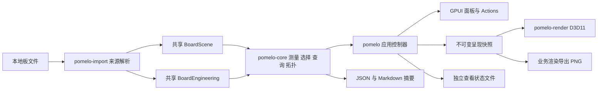

# Pomelo 桌面版审阅功能开发设计

编制日期：2026-10-03。状态：开发设计，尚未实施。范围依据：[审阅功能范围与实施计划](viewer-review-capabilities-plan.md)。

2026-10-04 的 [PCB Editor 只读能力补充调研](viewer-pcb-editor-research.md) 提供查询模板、结果导出、源 film 显示预设、字体与阻焊语义、双单位和跨层投影测量等补充建议。落实时需显式更新本设计的对应契约和验收；当前接口不能被视为已支持这些补充项。

用户安装完整 25.1 文档后的正式手册复核见该调研第 10 节。本文末尾“PCB Editor 完整手册补充契约”细化原两阶段任务；版本比较、原理图集成等独立候选不自动纳入。

本文把已确认的第一阶段“日常审阅闭环”和第二阶段“工程信息基础”转化为模块契约、算法、交互行为、开发任务和验收用例。A1–A7、B1–B7 编号沿用范围文档，开发和验证记录均应引用这些编号。

本文中的新类型、文件名、接口和资源门槛均为拟实施设计，不代表当前存在的 API 或已经测得的性能。具体实现可以调整内部拆分，但不得弱化功能语义、扩大用户已排除的范围或绕过验收。

## 范围与证据

交付面向当前 Windows 原生桌面应用，沿用 GPUI Kit、D3D11/HLSL、共享核心和五语国际化。参考 Allegro 的功能结果，交互继续使用 Pomelo 工作区。

不纳入 DRC、豁免错误、约束解析、合规判断、设计完成度、铜皮或背钻是否过期、3D、分屏、批注交换、脚本和操作回放。网格、可定制悬停字段、完整打印系统和新格式导入也不额外进入本次开发任务。几何净距、源属性和连接路径不输出规则检查结论。

### 当前已确认的实现起点

源码审查时桌面仓库 HEAD 为 `3eaa9363c1789b7c272d5053a13a0e25c4dccbb3`，工作区有大量未提交实现。该 SHA 仅标识基础提交，不能独立复现本次工作区；实际开发前须重新检查相关文件并冻结该批任务的源码和样本指纹。

| 当前文件 | 已确认事实 | 开发影响 |
| --- | --- | --- |
| `pomelo-core/src/interaction/selection.rs` | `SelectionTarget` 是单一对象、走线、网络或元件目标；统计保存二维中心线总长 | 不能直接充当任意多选集合或两点路径 |
| `pomelo-core/src/display.rs` | 有当前层、类别优先级、逐层显隐和铜皮透明度 | 扩展已有契约，不另建一套显隐规则 |
| `pomelo-render/src/text/msdf/labels.rs` | 已有六类 `LabelOptions` | 移到核心或转为核心输入，接入保存和界面 |
| `pomelo-core/src/view_state.rs` | 版本 1、严格字段校验、内容及编码身份匹配、单一选择 | 新查看状态需要显式版本迁移 |
| `pomelo-import/src/allegro/semantics/padstack.rs` | 有共享源 padstack 定义和解析器内缓存 | 提取格式无关定义，不向应用泄漏解析器生命周期 |
| `pomelo-import/src/allegro/semantics/connectivity.rs` | `NetworkMap` 保存网络归属 | 网络归属不是连接拓扑 |
| `pomelo-import/src/allegro/decoder/variable.rs` | 有原始 `Property`，包含未知字段和嵌入模型负载情况 | 需验证所有者关联；不能把全部负载当用户属性 |
| `pomelo-core/src/geometry/pad.rs` | 有放置变换、解析距离和自定义轮廓覆盖 | 可复用，点到形状距离不能代替形状对最短距离 |
| `pomelo/src/viewport/mod.rs` | 拥有较多输入、任务、选择和面板状态 | 新控制器按职责拆出，避免继续膨胀 |
| `pomelo-render/src/backend/d3d11/board.rs` | 帧数据和选择覆盖通道由业务后端管理 | 多组高亮和导出继续由业务渲染器承担 |

Web 参考目录：`C:/Users/Zen/Desktop/gitrepo/pomelo`。主要对照 `src/lib/board/display.ts`、`src/components/display-controls.tsx`、`src/components/display-order-panel.tsx`、`src/lib/interaction/picking.ts` 和 `src/components/object-inspector.tsx`。Web 差分用于复用和回归，不能作为未实现工程语义的正确性证明。

### 官方依据和实测状态

官方资料是本地 `algroviewer.pdf` 和 `algrofreeviewer.pdf`，位于 `C:/Cadence/SPB_25.1/share/pcb/help/pdf`，版本 25.1，2025 年 9 月。具体产品和章节见范围文档。

本次尝试通过 Computer Use 启动 `C:/Cadence/SPB_25.1/tools/bin/allegro_free_viewer.exe`，启动步骤返回 `Computer Use app approval timed out`。随后查询未发现可操作的 Viewer 窗口。因此本文没有新增官方软件实测结论，测量、叠层等行为采用文档依据与明确的 Pomelo 产品决策；待实测项目列在文末。

## 关键设计决定

| 事项 | 本文决定 |
| --- | --- |
| 几何数值 | mm、f64 源空间计算，单位在展示和输入边界转换 |
| 对象身份 | 类型化对象引用，禁止仅用裸数字去重不同对象类别 |
| 任意选择 | 保留选择意图和去重后的有效成员，主对象独立记录 |
| 隐藏对象 | 保留已有选择；框选默认只选择当前可见且可拾取对象 |
| 高亮 | 独立于选择，组成员为加入时的对象快照，不自动跟随未来查询 |
| 净距 | 选定共同物理层，计算实际占据区域距离，不作 DRC |
| 路径 | 基于明确拓扑，默认找二维线长最短的支持路径，允许途经点 |
| 铜皮路径 | 可表达连通，不能凭空赋予穿越铜皮的路径长度 |
| 属性 | 类型、单位、来源、缺失状态显式建模，未知数据不转零 |
| 网络组 | 可多重归属；源关系图有环时诊断并隔离，禁止递归失控 |
| 叠层 | 物理层序独立于显示顺序，厚度和材料缺失保持缺失 |
| 状态恢复 | 版本 2 显式迁移版本 1，源身份不匹配时拒绝对象状态恢复 |
| 输出 | PNG 加 JSON 和 Markdown 摘要；不依赖系统截图 |
| 异步结果 | 文档身份、导入 generation、功能 request 和输入 revision 全部匹配后发布 |
| 发布单位 | 每批形成可用入口、数据与验证证据，空面板不计完成 |

## 模块与数据流



### 拟新增模块

所有路径相对仓库根目录。目录在实现时按实际职责创建，不提前创建空目录或占位 API。

| 目录或文件 | 责任 |
| --- | --- |
| `crates/pomelo-core/src/model/object_ref.rs` | 统一类型化引用及场景身份校验 |
| `crates/pomelo-core/src/model/engineering/` | 属性、叠层、padstack、网络组、源连接和能力覆盖 |
| `crates/pomelo-core/src/geometry/measure/` | 自由点、吸附、占据区域、最近点和误差界 |
| `crates/pomelo-core/src/interaction/selection_set.rs` | 选择意图、集合操作、去重、主对象和比较 |
| `crates/pomelo-core/src/interaction/review_state.rs` | 高亮组、颜色覆盖、测量记录和命名视图契约 |
| `crates/pomelo-core/src/search/query.rs` | 条件表达式、索引、结果分页 |
| `crates/pomelo-core/src/connectivity/` | 按网络与层构建拓扑、路径搜索和覆盖状态 |
| `crates/pomelo-import/src/allegro/semantics/engineering/` | 已验证来源记录到工程模型的转换 |
| `crates/pomelo-render/src/scene/review_overlay.rs` | 多组高亮和测量标记的准备 |
| `crates/pomelo-render/src/backend/d3d11/export.rs` | 离屏目标、业务绘制、受控读回 |
| `crates/pomelo/src/viewport/controllers/` | 工具、选择、测量、查询、导航和高亮的应用协调 |
| `crates/pomelo/src/panels/` | 新增测量、查询、属性、焊盘栈、叠层、网络组展示 |
| `crates/pomelo/src/services/review_store.rs` | 版本化审阅状态和命名视图原子保存 |
| `crates/pomelo/src/services/review_export.rs` | 输出配置、PNG 编码、报告序列化和文件写入 |

保留既有公开模块重新导出。核心层不依赖 GPUI、D3D11 或 Cadence 解析器类型。GPUI 补丁仅承载通用 GPU 生命周期和目标信息；PCB 颜色、几何、测量与导出绘制仍属于 `pomelo-render`。

### 工程数据发布

拟在 `ImportedBoard` 增加 `Arc<BoardEngineering>`，与 `Arc<BoardScene>` 共享同一 `SourceIdentity`。工程模型持有格式无关数据，不持有 `BrdDatabase` 借用、GPUI Entity 或 GPU 资源。

对每项工程能力记录 `Available`、`Partial`、`Absent`、`Unsupported` 或 `Failed`，附覆盖对象范围和诊断。来源确实没有记录与解析器不会读取必须区分。失败的工程扩展不必使已有二维场景无法打开，但相关入口要明确显示原因，不能呈现正常的空值。

导入时完成已验证的基础工程数据；重型查询索引、拓扑和路径按需在后台构建。按文档和源身份缓存，以 `Arc` 分享不可变结果。发布整个结果或明确声明部分覆盖，不发布被取消的半成品。

## 共享契约

下列 Rust 片段是接口草案，使用说明性辅助类型，尚未编译。实现时需与现有模型对齐并补齐 Serialize、校验、错误及文档。

### 身份和数据可用性

```rust
enum ObjectRef {
    Segment(ObjectId), Pin(ObjectId), Via(ObjectId), Zone(ObjectId),
    Drawing(ObjectId), Text(ObjectId), Component(ObjectId), Net(NetId),
}

enum DataValue<T> {
    Known(T),
    Missing,
    NotApplicable,
    Unsupported { reason: MessageKey },
    Invalid { diagnostic: Diagnostic },
}

struct BoardEngineering {
    source: SourceIdentity,
    coverage: EngineeringCoverage,
    properties: PropertyIndex,
    padstacks: PadstackCatalog,
    stackups: PhysicalStackups,
    net_groups: NetGroupCatalog,
    source_connections: SourceConnections,
}
```

复用现有 `ObjectId`、`NetId`、`LayerId`，不要为同一来源创建另一套无法映射的 ID。绘图拥有的文字与独立文字要保留关系，避免选择或导出重复计数。原始记录偏移属于来源证据，不能直接用作用户看到的稳定身份。

`DataValue` 只表达业务缺失与可用性。取消、分配失败和无效任务用 `Result` 返回；不把错误都埋进每个正常字段。嵌入模型等大型二进制负载只存元数据或有界引用，不作为字符串属性复制。

### 任务身份与发布

现有 `RequestId` 表示文档导入 generation，不能代替测量或查询 revision。拟增加功能请求键：

```rust
struct ReviewRequest {
    document: DocumentId,
    import_generation: u64,
    feature_request: u64,
    input_revision: u64,
}
```

选择、显示、查询和工具控制器按影响递增各自 revision。提交后台任务时冻结输入，完成时逐项匹配。旧任务可以结束，但其结果不能覆盖新输入。关闭或重新导入文档时取消所有依赖旧源数据的任务。

渲染资源仍由现有设备生命周期持有；不得跨线程发送 GPUI Entity 或把 GPU 句柄写入持久化文件。小型 ID 用值传递，场景和大索引用 `Arc`，查询参数借用或冻结一次，不在帧循环复制全板。

## 第一阶段开发

### A3 任意选择集合

先完成集合契约，再接测量和高亮。保留现有四种选择模式，将一个点击解析为 `SelectionTarget`，然后应用集合操作。

```rust
struct SelectionSet {
    intents: Vec<SelectionTarget>,
    excluded: BTreeSet<ObjectRef>,
    members: Arc<[ObjectRef]>,
    primary: Option<ObjectRef>,
    revision: u64,
}
enum SelectionOp { Replace, Add, Toggle, Subtract }
```

`intents` 保留“选择整网”等用户意图，`members` 是去重后的有效对象。减去整网中的一个对象时加入 `excluded`；再次显式添加时移除对应排除项。替换选择清除旧意图与排除项。显式移除一个整网意图后，仍被其他意图覆盖的成员继续保留。

集合展开在后台完成，事务成功后一次发布。资源限制或取消时保留旧集合并提示原因，不能静默截断为“已选择全部”。成员面板分页只限制显示，不限制实际计数。

| 操作 | 行为 |
| --- | --- |
| 普通点击 | 替换为当前模式解析出的目标；空白清空选择 |
| Ctrl 点击 | 切换目标，目标成员已全部选中时减去，否则添加 |
| Shift 点击 | 添加目标，不取消已有对象 |
| 框选 | 选择工具下空白处开始；从左向右完全包含，从右向左相交 |
| Ctrl 框选 | 对已选集合减去框内结果 |
| 列表批量选择 | 操作完整结果或明确的已勾选行，不能只操作当前显示页却称全部 |
| 隐藏图层 | 已有选择保留，显示隐藏成员数量，画布不强制显示隐藏对象 |
| 候选切换 | 更换本次点击目标；不重新解释全部历史选择意图 |

矩形在源空间做最终判定；屏幕矩形只用于输入表达。铜皮孔洞内矩形不因 Zone 包围盒覆盖就命中。框选若索引未就绪，显示准备状态而非在 UI 线程扫描整板。

检查器比较按类型化字段和标准单位进行，显示共同值、多个值、缺失或不适用。跨类型无公共字段时仍显示类型统计和成员列表。主对象是最近有效操作的对象；删除主对象后按稳定成员顺序选择下一个。

### A1 点测量状态机

定义 `CanvasTool`，取代后续继续扩展单个 `pan_tool` 布尔：选择、平移、点测量、净距测量、框选放大。四种 SelectionMode 仍是选择展开方式，与工具分开。

```text
Idle -> AwaitingFirst -> PreviewSecond -> Completed
                           |
                           +-> Accumulating -> Completed
```

进入测量工具后第一次点击设置起点，移动显示第二点预览，第二次点击完成一个结果。连续模式逐次追加点，Enter 完成，Backspace 撤回最后一点。Escape 先取消未完成段；再退出工具。已完成测量记录保留在本次文档会话，可显隐、复制和清除，不属于可编辑批注。

临时按住中键允许平移，滚轮仍可缩放，不丢起点。打开弹层时 Escape 先关闭最上层弹层并恢复焦点，不能同时清除测量和选择。

给定 A、B：`dx = B.x - A.x`，`dy = B.y - A.y`，距离 `hypot(dx, dy)`，曼哈顿距离 `abs(dx) + abs(dy)`，角度按源坐标 `atan2(dy, dx)`，归一到 `[0, 360)`。重合点距离为零，方向显示不适用。连续长度是每段距离之和，采用补偿求和。

吸附候选包括走线端点、弧端点、引脚和孔中心。先用逻辑像素容差查询候选，再取精确源点；临时关闭吸附有明确控制。默认沿用现有拾取的五逻辑像素基线，可配置但不随 DPI 重复放大。显示吸附对象与自由点区别，不默默跳到隐藏层对象。

测量记录保存源坐标、吸附来源、类型、层、算法版本和单位无关数值，展示按当前单位转换。禁止保存格式化字符串再重新解析为数值。

### A2 净距模型与算法

净距输入是两项具体几何及共同层，不是两套任意选择集合。集合里恰有两个可测对象时可直接进入，否则要求用户指定 A 和 B。多层 pad/via 列出共同物理层，先采用当前共同层，否则提示选择；跨层投影模式暂不增加。

净距测量区分铜占据区域与钻孔占据区域。孔径开关和焊盘轮廓显示不会改变测量几何。普通对象净距采用铜几何；选择孔时明确标为孔间几何距离。没有焊盘定义时返回不支持，不从孔或默认圆猜铜形状。

```rust
struct ClearanceResult {
    layer: LayerId,
    gap_mm: f64,
    witness_a: Point,
    witness_b: Point,
    relation: RegionRelation, // Separated / Touching / Overlapping
    center_distance_mm: Option<f64>,
    error_bound_mm: f64,
    method: MeasurementMethod,
}
```

占据区域之间的距离在接触、相交和包含时均为零。只有两条边界的最近距离不能处理包含，必须先做区域相交或包含判定；重叠结果见证点取共同区域内一点，不画一条假净距线。

| 几何 | 实施方法 |
| --- | --- |
| 直线走线 | 有限线段与半线宽形成的胶囊区域，最近点考虑端帽 |
| 圆弧走线 | 有方向有限弧的扫掠区域；候选包含端点、弧内极值、相交点及端帽 |
| 圆形焊盘 | 圆区域；圆对圆采用解析值，包含或重叠返回零 |
| 方形、倒角和圆角焊盘 | 按现有 PadKind 拆为线和弧边界，使用完整放置变换 |
| 环形焊盘 | 外圆减内孔，孔内点不属于铜；不能用外圆代替 |
| 自定义焊盘 | 使用保存的解析路径与填充拓扑，外环和孔洞一起计算 |
| 铜皮 | 使用实际填充外环与孔洞；重叠孔洞按正式覆盖规则合并 |
| 槽孔 | 明确采用现有 DrillShape 所表示的轮廓，不假定圆孔 |

先统一 `OccupiedRegion` 和边界图元适配，再实现线线、线弧、弧弧最近点；边界 BVH 用包围盒下界剪枝，窄阶段计算真实候选，不做全边界笛卡尔积。对非凸或自交来源轮廓，复用正式覆盖语义；无法确定的拓扑返回不支持。

优先解析算法。必要的曲线离散化采用源空间弦高误差，并在结果中给出保守误差界；首版拟定单边弦高不超过 `0.00001 mm`，对象对距离误差界需计入两侧和数值误差。该值是开发目标，须通过极端半径和大坐标案例校准；超过片段或内存限制时明确失败，不能退到随缩放变化的显示三角形。

算术比较采用局部坐标减法及尺度相关误差控制。源数据库量化精度单独保留，不把算法的小数位数冒充设计精度，也不把测量误差容差复用于连接合并。

### A4 高亮组和颜色优先级

```rust
struct HighlightGroup {
    id: HighlightGroupId,
    name: String,
    color: ReviewColor,
    visible: bool,
    priority: u32,
    members: Arc<[ObjectRef]>,
}
struct ColorOverrides {
    layers: BTreeMap<LayerId, ReviewColor>,
    nets: BTreeMap<NetId, ReviewColor>,
    objects: BTreeMap<ObjectRef, ReviewColor>,
}
```

首版提供层色和网络色 UI；对象颜色字段为统一优先级保留，未交付对象颜色入口时不宣称该功能完成。颜色统一保存 sRGB，GPU 颜色转换沿用已有后端策略。板色属于数据颜色，可以使用用户数值；应用面板状态和按钮配色仍使用主题语义 token。

基础材料色优先级：对象覆盖 > 网络覆盖 > 图层覆盖 > 当前 Layer/Net 模式生成色。网络覆盖在两种模式下均有效，恢复网络默认即移除覆盖。高亮呈现优先级：当前选择 > 悬停 > 可见高亮组 > 基础材料；多组重叠按用户排序，第一组优先。检查器仍列出全部组成员关系。

组成员采用加入时的有效成员快照；查询或选择变化不改变旧组。新成员追加和成员移除为显式动作。组显隐、删除和清除与选择互不影响。高亮不使隐藏对象穿透显示规则。

编译对象到颜色覆盖表并按 revision 缓存。组颜色改变只更新覆盖资源，不重传整板几何；数十万成员仍按对象身份索引，禁止每个像素或每帧扫描所有组。

### A5 显示契约统一

把六类标签选项放到 `pomelo-core::display` 的格式无关契约，渲染层消费核心类型或兼容转换，避免持久化核心状态依赖渲染 crate。增加全局 pad/via 开关和全局透明度，沿用既有 copper_opacity。

保持当前 Web 已定义的透明度语义：常规填充使用全局透明度，铜皮填充及其标签使用铜皮透明度，不自动再乘全局值；铜皮边界在填充透明度为零时保留。选择和悬停保持可辨认的独立覆盖。分析线弧、文字、焊盘和钻孔实际管线后固定一张类别语义表，并用硬件案例验证，不能只在 UI 中增加一个未连接 slider。

显隐开关与透明度分开：显隐关闭的对象不参与拾取；透明度为零不等于隐藏，沿用现有 Web 与桌面已验证的候选规则，并向用户说明。“全局元件焊盘”与逐层 Pads 的关系为逻辑 AND；Via 同理。自动标签只跟随其所属可见几何，原始板文字单独控制。

当前层、优先级和旧 `layer_order` 的兼容策略：新入口统一编辑类别优先级；旧层序恢复为相应层的类别优先级，确认迁移后停止双重编辑。活动铜层仍按既有规则提升，物理层序不变。

### A6 命名视图与历史

命名视图保存相机、翻板、显示控制、标签、颜色覆盖。高亮组是文档审阅状态，视图可显式保存组显隐快照，但不复制整套成员列表。首版命名视图不保存临时选择或未完成测量，避免恢复视图时改变当前审阅对象。

导航历史仅记录相机和翻板，容量拟定 100 项。一次拖动结束算一个步骤；滚轮连续操作按 300 ms 空闲合并，搜索定位、适配、翻板和框选放大即时提交独立步骤。返回后发生新导航，删除前进分支。历史恢复不再次写入历史。

历史在当前会话内有效，不写入磁盘。命名视图和高亮组跨会话保存。窗口变化时保留中心和像素每毫米尺度；视图拟合操作另按当前窗口重算，不能在每次 resize 中覆盖用户恢复值。

源文件内容或编码改变后旧对象状态标为失效；首版不按位号或网络名模糊绑定旧对象。相同内容多标签页的即时状态互相独立，持久化操作采用 revision 和有序写入，避免关闭较早的会话覆盖较新的保存。

### A7 离屏图像和审阅包

输出固定为 PNG、`review.json` 和 `review.md`，可选择只导出 PNG。JSON 为结构化权威数据，Markdown 为可读摘要，包含源文件显示名、内容 SHA-256、单位、导出范围、选择摘要、测量方法与误差界。默认不输出源文件绝对路径。

导出选项包括当前视口或全部可见图元范围、输出尺寸、是否包含选择、高亮与已完成测量。整板范围按可见几何求 bounds，不擅自打开隐藏层；无可见几何时禁用并解释。

建立业务后端的离屏渲染目标，复用正式批次、排序、stencil、MSDF 和曲线策略，再读回 RGBA 编码 PNG。不得用最近文件 CPU 缩略图或操作系统截图替代完整导出。GPUI 原生 GPU 接口是否能承载离屏目标需要先做小型验证；若需通用补丁，仅增加目标和设备生命周期支持，不加入 PCB 业务。

读回必须等待对应 GPU 工作完成，处理 row pitch、通道顺序和 alpha；导出 DPI 与窗口 DPI 独立。图像分辨率提高时按导出像素尺度重新准备曲线和动态标签，不直接放大屏幕缓存。

拟定初始限制：边长不超过 8192 像素、总像素不超过 1600 万、一次一个导出，CPU 编码与读回预算另计。最终限制根据适配器能力和内存实测调整。取消后丢弃输出；先写同目录临时文件，成功后替换目标。审阅包在独立目录准备完毕后发布，失败保留原文件并说明未完成项。

导出冻结输入 revision；运行期间用户操作不改变已提交输出。设备丢失、字体不完整或资源不足时返回明确错误，不保存黑图或缺字图作为成功结果。

## 第二阶段开发

### B1 属性来源链路

先建立来源记录调查表，按数据库版本验证属性定义、属性值、对象所有者和直接/继承关联。现有 `Property` 的 unknown 字段不得在没有样本证据时命名成所有者指针。

```rust
enum PropertyValue {
    Text(String), Bool(bool), Integer(i64), Decimal(f64),
    Quantity { value: f64, unit: PropertyUnit },
    Opaque { display: String },
}
struct ObjectProperty {
    key: PropertyKey,
    source_name: String,
    value: DataValue<PropertyValue>,
    origin: PropertyOrigin,
    evidence: SourceEvidence,
}
```

保留原始属性名和原始单位；量纲已确认后才归一化。类型不明时使用 Opaque，不根据“字符串能解析成数字”自动转换。继承只展示已验证的来源关系，不计算约束优先级。

索引按对象引用指向共享属性定义和有界值数组，避免同一 padstack 或网络公共字段复制到每个对象。属性展示、查询和导出使用同一访问器。大二进制负载不索引内容。

### B2 对象查询契约

保留快速网络或位号搜索，新增“对象查询”工作流。查询默认 AND 组合条件，组内可 OR；界面首版不暴露任意执行脚本。查询表达式由类型化字段和运算符组成。

```rust
enum Predicate {
    ObjectKind(ObjectKind), OnLayer(LayerId), InNet(NetId),
    NameMatch { mode: TextMatch, text: String },
    PropertyCompare(PropertyKey, Comparison),
    NumericRange(NumericField, RangePredicate),
    And(Vec<Predicate>), Or(Vec<Predicate>),
}
struct QueryResult {
    members: Arc<[ObjectRef]>,
    matched_count: usize,
    coverage: QueryCoverage,
    revision: u64,
}
```

数值条件在提交时转换为标准单位，并校验量纲。文本采用现有确定性 Unicode 小写匹配，原名称不改变；首版提供包含、前缀、完全匹配，不增加正则执行面。

索引按类别、层、网络、归一化名称和常用数值字段建立，通用属性按实际使用的键延迟建立。查询先交集较小候选集合再执行昂贵条件。返回完整匹配身份及覆盖信息，结果表虚拟化并支持稳定排序。资源超限时保持旧结果，不能显示截断数量为总数。

缺失属性与值为零的筛选语义不同。只查询某类对象时，该类未解析属性会影响 coverage；已知无匹配与“无法完整查询”分开显示。查询结果可批量加入选择或高亮，动作作用于明确范围。

### B4 物理叠层模型

先补物理叠层，再让 B3 使用可靠层位置。物理层与显示图层分离；制造、文字、绘图和 bond-wire 类别不能被误当成有厚度的铜层。

每套叠层保存来源 ID、按物理次序的导体/介质条目、材料、厚度、已读取的介电参数及区域关联。源文件未提供条目不插入假介质层。Z 坐标以指定叠层顶面为零、向下为正，仅在前序厚度完整时计算。

如果厚度不完整，显示“已知厚度小计”，不显示确定总厚度。介电常数等参数要携带来源与频率条件（若有），不生成阻抗结果。叠层区域用真实边界与 ID 关联；只有区域编号时能力标为 Partial。

### B3 焊盘栈目录

把 `PadstackResolver` 内定义转换为核心的共享 `PadstackDefinition`，通过定义 ID 与 pin/via 实例关联。实例另保存位置、方向、镜像、区域、有效跨度和背钻。源定义与放置后几何必须可分别查看。

逐层定义区分 regular pad、antipad、thermal relief 和无焊盘；不从铜皮几何反推热焊盘参数。槽孔、镀孔、自定义路径和掩膜条目保留其来源类型。导入器内缓存仍属于解析过程，应用只持有转换后的不可变目录。

面板提供逐层表、所选层二维预览和简化层跨度示意；点击对应层可定位到画布但不强制改变整板显隐。背钻展示已读取的删除范围和保护层，不自行分析有效性。

### B5 网络关系图

定义 Group、NetClass、Bus、DiffPair、MatchGroup 和 XNet 等组类型，成员引用网络或其他组。源组 ID 与名称分开。模型允许多父关系，因此是图而不是单棵树。

导入完成时检测环、无效成员和重复成员；保留原始证据，运行时遍历用 visited 集合。UI 可在多个父节点下呈现同一网络，但选择、数量和高亮按真实 NetId 去重。

差分对不能仅靠命名建立。XNet 可能跨离散器件描述逻辑关系，不把 XNet 组自动当成一块导电铜，更不能把电阻两端变成零长度连接。此阶段只浏览源定义关系。

### B6 源连接和拓扑

把飞线、逻辑连接端点、铜几何关系分成不同数据集。飞线只能来自已验证的来源记录，保留端点、NetId、层或侧面、记录身份及覆盖状态。无来源飞线时提示没有可用记录，不采用所有引脚之间的完全图或最小生成树冒充。

拓扑按 NetId 构建，节点包含端点、焊盘接触、分支、过孔层连接和铜皮连通区域；边保存类型、对象来源、物理层、已知二维长度及覆盖。网络归属只能缩小候选集，不能直接产生导通边。

构建步骤：

1. 优先使用源数据已验证的连接和轨迹节点。
2. 按物理层建立宽阶段索引，收集同网几何接触候选。
3. 以实际占据区域接触判定窄阶段，分支接触处拆分线或弧边。
4. 仅通过已证实的镀孔跨度和有效层连接建立跨层边；非镀孔不导通。
5. 铜皮按实际连通填充区域建立区域节点，孔洞和不相连岛不合并。
6. 保存每个局部连接依据和未覆盖对象，生成网络级 coverage。

相交判定容差与吸附容差分开。用局部 f64 运算和来源量化信息控制数值误差；默认不因“距离很近”而连接。只有已验证的同一来源节点关系才允许修正量化端点差异，并保存依据。

背钻、未使用焊盘抑制、刚柔层映射和 thermal 链路未验证时，相关拓扑标为 Partial，不能声明完整导通。不同层投影交叉不连接；不同 NetId 的铜接触不在本范围生成短路诊断。

导电连通图和可计长路径图需要区分。宽走线、焊盘或铜皮区域相互重叠可以证明连通，却不一定确定唯一的中心线路径；不能把接触区域任意投影到两条中心线，再把跨越区域的长度设为零。源轨迹连续关系或已验证的中心线交点可产生可计长边，其他连接以长度未知的区域桥接表示。这与铜皮未知段采用同一结果机制。

### B7 路径搜索和长度

用户选择两个对象或端点，并可指定途经点。连接图中执行非负权重最短路径，权重为可测二维中心线长度；零长度拓扑边允许存在，算法需防止回路。结果使用稳定 ID 打破等价路径排序，保证重复查询可复现。

路径结果分为 Found、Disconnected、Incomplete、Ambiguous 和 Unsupported。仅在相关图完整且确无路径时输出 Disconnected。找到一条已支持路径但存在未覆盖替代边时仍说明最短性未证明。

多路径不枚举无界集合。首版展示默认路径，支持通过途经点选择其他分支；可列有限候选并说明不是全部。铜皮区域可证明连通，但其内部长度未知，结果报告已知线长和未知区域段，不能赋零后宣称全路径长度完整。

在返回模型中将“找到路径”“长度完整”“最短性已证明”“存在替代路径”作为不同字段保存；上述状态名称用于界面概括，不能让单个枚举吞掉这些组合。存在未知长度边时先求连通与候选路径，不能把未知边喂给二维长度最短算法。所有边长度已知且有关图覆盖完整后才保证最短性。

过孔计数按路径中经过的独立物理过孔身份去重，不能按每条层边重复计数。过孔深度不加入二维长度；同一走线被拆成多边后按真正经过的区间求和，不把整条源走线重复累加。圆弧长度采用经过扫角乘半径。

路径高亮是一个单独的结果覆盖，可转换为持久高亮组。隐藏层不参与“只显示可见片段”的图构建；结果仍描述真实支持路径，并列出当前隐藏的路径成员。

## 界面与命令

沿用多文档、可调侧栏和画布中心的工作区。高频测量工具进入画布工具栏；查询、网络组、视图及高亮组采用现有侧栏模式；属性、焊盘栈和测量详情放入检查器。复杂数据表按需扩大或折叠，不用一个新模态窗口阻塞每次检查。

所有重要操作通过正式 Action 接入工具栏、菜单和键盘，展示模块只接收状态与回调。新命令拟包含 BeginPointMeasure、BeginClearanceMeasure、OpenObjectQuery、AddHighlightGroup、SaveNamedView、NavigateBack、NavigateForward、ExportReview。实际名字及快捷键在检查现有绑定后固定，禁止抢占文本输入和已有候选切换键。

| 场景 | 必须呈现的状态 |
| --- | --- |
| 无文档 | 工具不可执行，并有打开文件路径 |
| 测量缺一个点 | 明确说明下一步和当前吸附目标 |
| 净距无共同层 | 提示无可用共同物理层，不显示零 |
| 属性未支持 | 显示来源覆盖状态，不显示正常空表 |
| 查询进行中 | 保留条件，显示真实等待，可以取消 |
| 查询无匹配 | 区分完整零结果与覆盖不完整 |
| 路径不完整 | 列出未知连接段，不给确定全长 |
| 导出失败 | 保留当前文档和输入，可重试 |

遵循 GPUI Kit：Button 用于应用命令，Link 用于外部资源；使用组件语义大小和主题 token；标准菜单、弹层和焦点系统承担键盘行为。Escape 只关闭当前最上层状态。颜色、选中、悬停、焦点和不可用状态分别表达，不能仅靠颜色区分网络关系或测量类型。

数据列表和表格虚拟化，按对象 ID 保持选择。长译文、五语、深浅主题、最小窗口、125%/150%/200% DPI 以及界面字体缩放均纳入实窗验证。尺寸与对齐使用现有 rem 体系，不在设计文档里强塞固定像素布局。

## 保存格式与迁移

版本 1 `ViewState` 保持独立读取类型。外层先读取 schema_version，再分派到 V1 或 V2 校验，不能直接让新严格结构吞掉旧字段。迁移旧的单一 selection 为一项意图，标签和新透明度采用兼容默认值，旧显隐和翻板保持。

版本 2 保存基本查看状态、选择意图与排除项、颜色覆盖、高亮组和命名视图；不保存派生成员缓存、导航历史、未完成测量、GPU 数据或索引。已完成测量首版为会话数据，通过审阅导出保存，避免无提示地增加批注功能。

源身份校验通过后再校验所有对象、层和组引用。局部失效项单独禁用并说明，不因一个高亮组损坏而让整个文档打不开。未知新版本拒绝改写，原文件保留。计数、字符串、颜色范围和尺寸均有上限。

沿用 services 的配置根目录和原子写入。写入请求排队合并，保存 revision 单调递增；失败时不更新内存中的“已保存”标记。首次 V1 到 V2 迁移保留可恢复旧文件，不直接覆盖后再验证。

## 性能与资源

以下为首轮可调整的实现预算，不是已测得结果或发布承诺。调整需记录样本、理由和前后效果。

| 项目 | 初始设计 |
| --- | --- |
| 任意选择有效成员 | 上限 100 万对象；后台展开，超限原子失败 |
| 持久高亮 | 最多 32 组，总成员引用不超过 100 万，共享集合并预算计费 |
| 测量会话记录 | 最多 1000 条，累计点数单独限制 |
| 导航历史 | 100 项，手势合并，不逐帧保存 |
| 命名视图 | 每源文件最多 64 项 |
| 后台工程重任务 | 单文档串行重建，应用级重任务并发上限 1；轻量查询可替换取消 |
| 补充工程索引 | 初始额外预算 256 MiB，与源文件、CPU 场景和 GPU 内存分别核算 |
| 临时查询或路径 scratch | 初始 128 MiB，按对象数量和字节双重预检查 |
| 长循环取消 | 每有界批次检查，初始每 1024 个对象或边；不可取消排序另拆分或限制 |

显示变化尽量更新小型常量或覆盖表。需要重建的结果使用输入 revision 缓存；多份快照保留期间计入峰值内存，不能只统计最终 Vec。UI 线程只协调和呈现，不遍历整板做条件过滤、净距或图搜索。

先记录代表性小、中、大板基线，再制定 release 查询耗时和取消延迟门槛。记录均包含板文件 SHA、对象规模、适配器、DPI、构建指纹和测量方式。

## 开发任务与交付顺序

下列批次属于两个已授权阶段内部，不增加产品阶段。

| 批次 | 编号 | 开发任务 | 依赖与完成证据 |
| --- | --- | --- | --- |
| D0 契约准备 | A3/B1/B4/B6 | 冻结 ObjectRef、availability、revision 和来源调查表；记录基线 | 模型评审、真实字段清单；不宣称功能交付 |
| D1 显示控制 | A5 | 标签契约迁移、开关、透明度、当前层和类别顺序 | 保存迁移、硬件与实窗；复用现有资源 |
| D2 选择集合 | A3 | 意图、排除、框选、主对象、比较和批量操作 | 集合数值与任务取消测试，实际选择流程 |
| D3 点和净距 | A1/A2 | 工具状态机、吸附、占据区域、最近点、孔洞 | 解析参考值、真实样本、实窗标记 |
| D4 保留重点 | A4/A6 | 高亮组、颜色、命名视图、历史和 V2 迁移 | 跨文档、重开、局部失效与写入故障 |
| D5 输出闭环 | A7 | 离屏接口验证、PNG、JSON、Markdown 和取消写入 | 图片对照、缺字与设备故障、输出包检查 |
| D6 属性与查询 | B1/B2 | 所有者链验证、属性转换、索引、条件及结果操作 | 源记录对应、量纲与查询完整性 |
| D7 结构信息 | B4/B3 | 物理叠层、区域和共享 padstack 目录 | 逐层、材料、孔及变换样本 |
| D8 网络关系 | B5/B6 | 源分组和飞线、按网按层拓扑、coverage | 多父关系、环、相交和跨层反例 |
| D9 指定路径 | B7 | 端点/途经点、图搜索、部分长度、结果高亮 | 分支、回路、铜皮未知段和断开证明 |

每批开发前重读相关源码与适用规范，列明实际将改的文件。先核心算法和数据，再应用控制器和渲染，最后实窗验收。必要的重构与功能同批进行并覆盖回归，不要求先重写整个视口。

## 测试与验收用例

以下是必须执行的用例设计，尚未执行。参考值优先使用独立解析公式、手工已知模型和官方可读取结果，不让测试只调用同一个实现生成答案。

### 几何与选择

| 编号 | 输入或操作 | 预期 |
| --- | --- | --- |
| M01 | A=(0,0)，B=(3,4) mm | 距离 5，dx=3，dy=4，曼哈顿 7，角度约 53.130102 度 |
| M02 | 点序列 (0,0)、(3,4)、(6,4) | 累计长度 8 mm；撤回一点后为 5 |
| M03 | 相同点 | 距离 0，方向不适用，无 NaN |
| M04 | 1 mm 显示为 mil | 约 39.37007874015748 mil，内部值仍为 1 mm |
| M05 | 同一测量翻板、缩放、DPI 改变 | 数值不变，标记投影正确 |
| C01 | 半径 1 和 2 mm 两圆，中心距 5 mm | 净距 2 mm，中心距 5 mm |
| C02 | 两条平行线中心距 1 mm，宽度 .2 和 .4 mm | 净距 .7 mm，覆盖有限端点情况 |
| C03 | 同心圆包含 | 铜区域净距 0，关系重叠，不能输出半径差 |
| C04 | 环形 pad 外半径 2、内半径 1；孔内同心圆半径 .5 | 净距 .5 mm，不能判铜重叠 |
| C05 | 半径 2 的同心 90 度与半径 4 同角弧，宽度均 .2 | 无端帽更近时净距 1.8 mm；另测有限弧端点情况 |
| C06 | 中心距相同，旋转/镜像/偏移不同的自定义 pad | 结果来自实际放置轮廓，交换输入距离对称 |
| C07 | 对象位于 Zone 孔洞内 | 与铜边计算距离，孔内不判填充重叠 |
| C08 | 没有共同层 | 无可测共同层，不显示 0 mm |
| C09 | 大坐标小间距、退化路径、无穷值 | 保持精度或明确拒绝，无 panic/伪正常结果 |
| S01 | 选择整网后加入其中一个 pin | 成员与统计不重复 |
| S02 | 从整网选择中移除一个 pin，再追加 | 排除项和恢复符合意图契约 |
| S03 | 两个元件有相同位号 | 按不同放置 ID 区分，不能合并 |
| S04 | 包含框与相交框经过铜皮孔 | 使用实际几何，结果不是包围盒误选 |
| S05 | 选择展开期间关闭或重新导入 | 旧结果不发布，新文档不串选 |
| S06 | 选择对象后隐藏层 | 选择保留，画布不强制显示，隐藏计数正确 |

### 工程语义与路径

| 编号 | 输入或操作 | 预期 |
| --- | --- | --- |
| P01 | 数值零、缺失、类型未知、继承未解析 | 四种语义不混同 |
| P02 | 属性负载包含嵌入模型 | 不当文本展开，不索引整个二进制 |
| Q01 | 同一长度阈值分别以 mm/mil 输入 | 命中身份集合一致 |
| Q02 | 超过一页查询结果，全选后高亮 | 操作完整结果；分页不改变总数 |
| Q03 | 属性仅部分解码且无已知匹配 | 报告覆盖不完整，不能声称完整零结果 |
| L01 | 已知厚度完整的四层样本 | 物理顺序和厚度正确，总厚度可求和 |
| L02 | 介质厚度缺失 | 展示缺失和已知小计，不输出确定总厚度 |
| L03 | 修改显示层优先级 | 物理层表和过孔跨度不改变 |
| L04 | 两套区域叠层、槽孔、非镀孔、背钻 | 按真实定义对应，不猜有效跨层连接 |
| G01 | 一网属于两组、组之间成环 | 身份去重，环被诊断且遍历终止 |
| G02 | 网络名像差分对但无来源关系 | 不生成已确认差分对 |
| G03 | XNet 跨电阻两端 | 浏览逻辑关系，不产生零长度铜导通 |
| T01 | 同层同网 T 分支和断开反例 | 接触点拆边，真实间隙不连接 |
| T02 | 不同层投影交叉 | 不连接 |
| T03 | 镀孔跨度确认与跨度未知各一例 | 前者按支持层连接，后者 Partial |
| T04 | Zone 两岛、孔洞和未验证 thermal | 区域独立；不完整连接有说明 |
| R01 | 直线加半径 2 mm、90 度圆弧 | 弧长为 pi mm，所选区间求和正确 |
| R02 | 多路径和零权重回路 | 默认稳定，无无限循环；途经点可改分支 |
| R03 | 一过孔跨多层边 | 过孔数量为 1，二维线长不加钻孔深度 |
| R04 | 仅能通过铜皮区域连通 | 显示已知线长和未知段，不给虚假全长 |
| R05 | 完整断开图与不完整图 | 分别输出 Disconnected 和 Incomplete |

### 状态 渲染和输出

| 编号 | 输入或操作 | 预期 |
| --- | --- | --- |
| V01 | 读取 V1 配置 | 旧相机、翻板、显隐、单位和选择迁移一致 |
| V02 | 一个组包含失效对象 | 单组或单引用失效，其他状态继续可用 |
| V03 | 源 SHA 或编码变化 | 不自动绑定旧对象状态 |
| V04 | 后退后新导航，滚轮和连续拖动 | 前进分支清除，手势按契约合并 |
| H01 | 两高亮组重叠、选择和悬停变化 | 颜色优先级固定，组成员保持 |
| D01 | 每种标签开关和全局 pad/via 开关 | 渲染、拾取及恢复按同一显隐契约 |
| D02 | 全局/铜皮透明度 0、.5、1 | 类别语义表一致，边界与选中可辨认 |
| E01 | 当前视口及整板 PNG | 正式图元、文字、裁剪和覆盖正确，不包含应用 chrome |
| E02 | 高分辨率导出、不同 row pitch | 没有拉伸、错行、颠倒、通道或 alpha 错误 |
| E03 | 导出期间更改画布及取消 | 输出冻结或取消；不会混入新视图 |
| E04 | 磁盘失败、GPU 丢失、字体失败 | 没有成功黑图，不损坏原输出或当前文档 |
| E05 | PNG、JSON、Markdown 对照 | 单位、源 SHA、选择数和测量数值一致 |
| U01 | 五语、两主题、键盘、DPI、最小窗口 | 入口可达、焦点可见、数据可阅读，Escape 层级正确 |

真实样本先用已存在的 USBC_FPC、LPDDR4、AGILEX 及官方 Cadence_Demo 检查适用项；不能假定这些样本天然覆盖属性、刚柔、网络组或未布连接。缺覆盖时登记样本需求，使用可公开合成样本或用户允许的真实样本补证，不把外部板文件提交到仓库。

### 开发检查命令

文档编制未执行下列产品检查。每批实现后按改动范围选择目标测试，核心算法必须做独立参考回归；必要的 GPU 和实窗测试按专项条件显式运行。

```powershell
python scripts/cargo.py +stable fmt --all -- --check
python scripts/cargo.py +stable test -p pomelo-core --locked --offline
python scripts/cargo.py +stable test -p pomelo-import --locked --offline
python scripts/cargo.py +stable test -p pomelo-render --all-features --lib --locked --offline
python scripts/cargo.py +stable clippy --workspace --all-targets --all-features --locked --offline -- -D warnings
python scripts/cargo.py +stable build -p pomelo --locked --offline
```

仓库固定工具链和包装器以实际配置为准；`+stable` 仅在本机 stable 与固定版本匹配时使用。硬件或外部案例默认忽略项必须另行记录是否执行，不能把普通测试通过写成硬件通过。

## 官方 Viewer 待核对清单

用户已允许在必要时打开已安装的官方 Viewer。以下为下次可执行核对流程，不是本次实测记录。打开板文件保持只读，只改变查看状态；使用不同板或配置需要重新记录来源。

首选官方样本：`C:/Cadence/SPB_25.1/share/pcb/examples/board_design/Cadence_Demo.brd`，本次已确认路径存在。只有软件成功打开并显示板文件后才开始记录功能行为。

| 核对项 | 操作与应记录内容 | 对 Pomelo 的影响 |
| --- | --- | --- |
| 净距 | 按文档 Alt 测量不同 pin/via/trace，记录共同层、中心距与最近点 | 验证几何语义；不照搬快捷手势 |
| 铜皮孔洞和包含 | 选择实际孔洞附近对象，记录零值和不可测条件 | 验证 occupied region 和失败表达 |
| 多选 | Ctrl 追加不同对象及同类对象，观察共同字段、清除与隐藏层 | 对照行为边界，Pomelo 以本文契约为准 |
| 焊盘栈 | 选择 pin/via，观察逐层定义、thermal 和背钻字段 | 校准来源字段和实例定义区别 |
| 叠层报告 | Tools 中打开 Cross-section Report | 核对层序、厚度、材料和缺失信息 |
| 查询 | 通过 Search 和属性关联查看结果，观察完整数与过滤 | 验证对象字段和联动需求 |
| 网络关系 | 查看 Nets 下组、差分对、XNet 和成员 | 校验源定义及多重归属 |
| 标签与透明度 | 切换 Display 选项，分别调全局和铜皮透明度 | 固定类别透明度语义和标签范围 |
| 飞线 | 选已保存未布连接的样本，按网和元件查看 | 校验来源 rats，不生成假记录 |

路径测量和颜色视图在 APD+ 文档中的描述不能自动当作当前 PCB 免费版实测。只有目标程序实际提供入口并成功操作，才能在验证记录中标为“官方软件已核对”；菜单缺少或样本无相应数据也需如实记录。

每条实测记录包含程序版本、样本 SHA、操作前后状态、观察值、必要截图、结论和未验证项。不记录只按下按钮就算通过，也不把显示相似作为二进制字段含义已经确认。

## 风险与实施前验证

| 风险 | 必须先解决的事项 |
| --- | --- |
| 属性所有者链未知 | 对象与属性逐项关联证据，不猜 unknown 字段 |
| 物理叠层字段不完整 | 版本与字段能力表，局部缺失表达 |
| 连接关系被几何投影误导 | 按层和跨度反例，网络级 coverage |
| 铜皮连通与长度混同 | 区域边可连通但长度未知的结果契约 |
| 净距复杂边界误差 | 独立参考案例、误差界和有界资源 |
| 导出与 GPUI 目标能力不匹配 | D5 前做最小离屏原型，不假定不存在的 NativeGpu API |
| 大选择集合内存与 GPU 覆盖 | 集合共享、预算、异步发布和缓存失效验证 |
| 配置迁移破坏旧状态 | V1 fixture、备份和原子写入故障测试 |

需要引入几何或图算法依赖时先核对现有依赖、许可证和实际适用性，不在文档里预先承诺某个未经验证的库。优先复用现有路径、放置和空间索引语义。

## 完成记录

实现状态以每批独立验证文档为准，建议命名为 `review-display-validation.md`、`review-selection-validation.md`、`review-measure-validation.md`、`review-state-validation.md`、`review-export-validation.md`、`engineering-properties-validation.md`、`engineering-stackup-validation.md`、`engineering-connectivity-validation.md`。这些是未来文档名，当前不建立无证据的占位记录。

每份记录必须包含任务编号、源码与二进制指纹、样本、实际执行命令、数值或操作结果、硬件与实窗范围、未覆盖内容。第一阶段完成需 D1–D5 形成可操作闭环；第二阶段完成需 D6–D9 在声明支持范围内形成完整数据和查看链路。

产品范围变更以用户新决定更新范围文档，再同步本文。已排除的 DRC、约束、状态检查、3D 和协作能力不作为“顺便完善”加入开发。

## PCB Editor 完整手册补充契约（2026-10-04）

以下为原两阶段的执行细化，尚未实现。来源、逐项对照和产品限定见 [正式手册复核](viewer-pcb-editor-research.md)。不依赖 Allegro 命令 UI 或在源数据库执行命令。

### B2 查询表格、模板与结果导出

- 查询结果发布完整计数、coverage 和稳定 ID；UI 分页/虚拟化与查询截断分开。浏览一行可定位但不自动清空当前选择，显式“替换选择/加入选择”复用 A3。单元格选择/复制与画布对象选择是两个状态。
- 列支持排序、过滤、重排、自动宽度；多值列过滤、AND/OR 表达式使用原类型化查询模型。文档中模糊的“regular expression AND”描述不改变现有不执行正则/脚本的约定。
- 查询模板保存 version、AST、列/排序、单位与显示名；不保存命中对象 ID、原结果或文件绝对路径作为查询依赖。导入其他板重跑，遇到不支持字段返回明确诊断而非静默忽略。
- CSV 支持“全部匹配/当前选中”显式范围，不把视口或当前页当全集；包含稳定身份、单位、source coverage。按 RFC 4180 转义；对可能被表格软件执行的字符串采取导出文本处理，原始数值与源值在内部保持不变。取消导出不留下成功文件，使用临时文件完成后发布。

### A4/A5/A6 聚焦、层控制与源显示配置

- 聚焦状态存目标集合和进入前的显示快照；淡化只调整上下文亮度，高亮颜色不受此调整。透明度另算；不修改对象实体、源网色和拓扑。退出后精确恢复，目标删除或文档关闭清理状态。
- 层可见性使用 `layer × category`，铜/引脚/过孔/连接线及绘图类别分别可控。全局开关与每层开关合取；临时逐层查看保留用户原设置。隐藏和仅淡化沿用原拾取语义，不能改变电气连通性。
- 若源解析支持 film，导入只读 preset `{source_key, name, referenced_layers/classes, coverage}`；未知引用标记部分，应用前预览范围。用户命名视图保存解析后的显示状态和来源信息，用户操作不回写 BRD film。
- 增加板主体 fit 与全绘图 fit 的范围区分。板外形优先；缺失时采用有效几何 bounds 并说明降级。图框/图例不可撑大主体 fit。
- 无焊盘孔可显示辅助孔轮廓，但仍为孔类别，不转化为铜焊盘或导电接点；绘图/导出明确是否包含该辅助层。读取源抑制状态与执行 unused pad suppression 分开，后者禁止。

### B1/B3/B4 工程字段和清单

- 几何详情增加弧圆心/半径、线段端点、局部宽度与变换信息。源属性链接需显式用户点击；属性字符串不自动加载外部资源。
- 叠层增加层用途、厚度公差、材料/fill-in material、物理 Layer ID、含/不含 mask 总厚度的来源与完整度。多 stackup 维持各自 layer ID 映射和区域来源；不跨区域叠加总厚度。
- 背钻保留源字段名及含义：must-cut 与 must-not-cut 是不同字段；深度和 manufacturing stub 若缺失则未知。槽孔定义 Size X/Y 与旋转/镜像后实例几何分别保存。
- 用同一 `BoardEngineering` 事实模型派生器件/BOM、引脚、网络成员、焊盘定义/使用、槽孔、背钻、过孔按网/层和网络属性清单。明细行稳定 ID 可定位；汇总行下钻为实例集合。聚合范围和缺失字段在面板及 CSV 一致显示。
- BOM 合并依赖有来源的物料标识/字段，不按位号前缀或封装猜物料一致。测试点已有源标记可作为属性浏览，但不派生覆盖率/未测试诊断。
- 走线聚合按网络/层/宽度统计中心线，过孔计数以物理实例去重；每层明细可以重复列出跨层实例，但全局总数不能相加重复计算。引脚对长度必须使用 B7 路径，不能用全网总长度代替。

### A1/A2/B7 测量语义补充

- 原有有符号 ΔX/ΔY 保留，标明方向；可附加绝对量，不能无说明改成 Allegro 的绝对 Dx/Dy。累计点距与累计中心线路径长度分别存储。
- mm/mil 双单位从同一 f64 mm 基值格式化；不使用已舍入显示字符串再次换算。
- 跨层对象允许独立“平面投影距离”模式；保存两端物理层与模式。它不能显示为同层铜净距或三维空间距离，不绕过原 A2 公共物理层要求。
- 路径局部宽度可显示为段列表或 min/max/变宽状态。没有路径时不能拿鼠标直线距离填充路径长度；有多个路径时维持原最优性/替代路径/途经点契约，不能声称 Allegro 保证最短路径。

### 新增验收用例

| 编号 | 验收 |
| --- | --- |
| X01 | 超过 20 条查询结果仍可浏览全集，总数/coverage 正确，分页不改变导出范围 |
| X02 | 查询模板跨板复用重新执行；缺失字段明确提示，单位过滤不误用旧板单位 |
| X03 | 表格单元格复制/排序/重排不意外改变对象选择；批量添加/替换遵守 A3 |
| X04 | CSV 含逗号、引号、换行和公式样式源字符串时安全、可读；取消不产生成功输出 |
| X05 | 聚焦进入/退出精确恢复显示状态；亮度/透明度独立，隐藏不改变连通图 |
| X06 | 每层 pin/via/copper 与全局开关组合正确；逐层查看可恢复；源 film 缺引用提示部分 |
| X07 | 图框远大于板主体时两种 fit 产生正确不同范围，外形缺失降级明确 |
| X08 | 无焊盘孔仍可见辅助轮廓，铜占用/连通性不增加，不触发源焊盘生成 |
| X09 | BOM 汇总不混合不同物料；清单汇总可定位全部源实例；缺失镀孔/背钻字段不猜测 |
| X10 | 槽孔旋转镜像后定义尺寸不被包围盒替换；must-cut 与 must-not-cut 分开 |
| X11 | 多 stackup/区域中层映射、厚度与钻孔跨度正确，缺失时显示部分而非假全板厚度 |
| X12 | 走线按层/宽度长度与独立参考一致，过孔全局去重，引脚对不返回全网总长 |
| X13 | 双单位来自同一基值；有符号差值、绝对量、点距累计和路径累计标签不混淆 |
| X14 | 跨层投影结果在画布/面板/导出中均标模式；同层铜净距仍要求公共物理层 |

批次归属：X01–X04 放入 D7；X05–X08 放入显示/视图批次 D1–D4；X09–X12 放入工程信息 D6–D9；X13–X14 放入测量与路径对应批次。新增源字段须先补解析证据和 coverage，再开放完整 UI；无来源时保留明确不可用状态。

几何版本比较、原理图跨探针、可定制悬停、新格式、完整打印和此前排除功能仍不纳入上述批次。字体与正向阻焊属于显示兼容性候选，执行前补源结构/字体回退与覆盖预览契约；不以这节的其他工作暗含完成它们。
